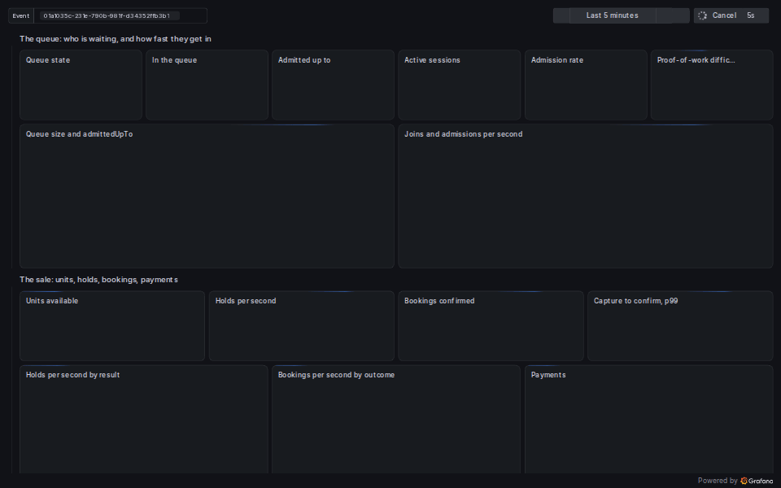
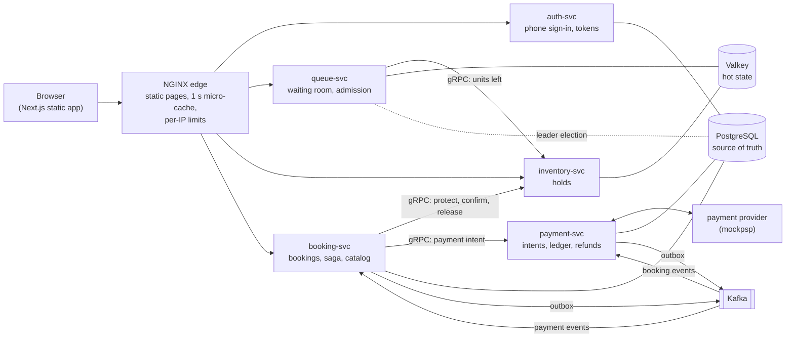

# HoldFast

A surge-proof booking engine. When 500,000 people chase 1,000 seats, HoldFast
sells exactly 1,000 (never 1,001), keeps everyone's money safe, gives everyone
who arrived before the sale opened the same chance, and stays up while doing it.



*The mission-control dashboard during a k6 stampede on the waiting room
(scaled to a laptop: about 2,500 users joined), while a ticket is bought by
hand in a real browser: the queue fills, admissions flow, and the purchase
shows up as a hold, a confirmed booking and a payment. Method and numbers:
[`loadtest/results/README.md`](loadtest/results/README.md).*

> **Status:** [v0.4.0](https://github.com/Sanjay-Mx21/holdfast/releases/tag/v0.4.0) is the resume-ready product: phone sign-in, the sale rules, proof of work, the web app and this dashboard, on top of the MVP backend of [v0.3.0](https://github.com/Sanjay-Mx21/holdfast/releases/tag/v0.3.0). Next: Phase 5, reliability (the reconciler and auditor, Valkey high availability, chaos experiments). The full design and build plan: [`docs/design/holdfast-design-and-build-plan.mdx`](docs/design/holdfast-design-and-build-plan.mdx).

## The problem

Ticket drops in India keep breaking:

- **Concerts.** On 22 September 2024 about 13 million people logged in to
  BookMyShow for roughly 1.8 lakh Coldplay tickets. They sold out in about 30
  minutes; fans reported crashes, being logged out as the sale opened, and
  tickets reappearing on resale sites at inflated prices.
  ([Malay Mail](https://www.malaymail.com/news/showbiz/2024/09/29/coldplays-three-concerts-in-india-sells-out-in-30-minutes-tickets-resold-for-as-high-as-rm49261/151988),
  [Pollstar](https://news.pollstar.com/2024/10/15/its-become-a-joke-coldplay-onsale-exposes-issues-with-indias-ticketing-systems/))
- **Railway Tatkal.** Since July 2025 only Aadhaar-verified users may book
  Tatkal online, with OTP verification, and agents are locked out of the first
  30 minutes, explicitly to curb bots and bulk booking.
  ([AIR News](https://www.newsonair.gov.in/aadhaar-authentication-made-mandatory-for-online-tatkal-ticket-booking-from-july-15),
  [Deccan Herald](https://www.deccanherald.com/amp/story/india%2Fonly-aadhaar-authenticated-users-can-book-tatkal-tickets-from-july-1-railway-ministry-3580809))
- **Money.** RBI's framework makes banks reverse failed transactions on a
  deadline and compensate ₹100 a day for delays.
  ([RBI](https://www.rbi.org.in/scripts/NotificationUser.aspx?Id=11693))
- **Abuse.** OWASP's API Security Top 10 lists *unrestricted access to
  sensitive business flows* (API6); its example of such a flow is buying a
  ticket. ([OWASP](https://owasp.org/API-Security/editions/2023/en/0xa6-unrestricted-access-to-sensitive-business-flows/))

HoldFast turns each of these into an engineering requirement. The core idea:
separate **waiting** (cheap, cacheable, massive) from **buying** (expensive,
correct, admission-controlled).

## Architecture



- **The waiting room** (queue-svc) gives everyone who joins before the sale
  opens a random place (a lottery), and arrival order after. One leader per
  event admits people at a set rate, within a concurrent-session budget and
  the units left. Everyone polls one shared status document, which the edge
  serves from a one-second cache, so the origin's load stays flat however
  many people wait.
- **Holds** (inventory-svc) are single atomic Lua scripts in Valkey: no locks,
  no check-then-act races.
- **Bookings and payments** (booking-svc and payment-svc) run as a saga over
  Kafka with transactional outboxes; a PostgreSQL **final guard** decides
  every sale, so overselling is a constraint violation whatever the fast
  path believes.
- **Identity and abuse:** phone-code sign-in with rotating refresh tokens,
  verified-only and agent-lockout windows (the Tatkal rules), a proof of work
  per join that rises with demand, rate limits per IP and per user, and a
  freeze switch.

More: [`docs/architecture.md`](docs/architecture.md) and the service docs in
[`docs/services/`](docs/services).

## Invariants, and how each is enforced

| ID | Invariant | Enforced by |
|---|---|---|
| I1 | **No oversell:** confirmed units never exceed capacity | `hold.lua` (one atomic check-and-decrement in Valkey), then the PostgreSQL final guard's conditional `UPDATE` for every sale |
| I2 | **No double charge:** at most one captured payment per booking | One payment intent per booking, keyed idempotently at the provider; webhooks deduplicated by event ID |
| I3 | **Money safety:** every captured payment ends CONFIRMED or REFUNDED | The booking saga (confirm, or ask for a refund when the guard refuses), status polling for lost webhooks; the reconciler arrives in Phase 5 |
| I4 | **Per-user cap:** held plus bought units per user never exceed the limit | The per-user counter in `hold.lua`, and the guard's conditional upsert |
| I5 | **No lost units:** every hold ends SOLD or RELEASED | The expiry index and sweeper; `release.lua` and `confirm.lua` re-check state atomically |
| F1 | **Fairness:** random order before T0, arrival order after, one place per identity | `join.lua` (`ZADD NX`, a `crypto/rand` score before T0, a counter after), checked step by step against a reference model |

Every mutating API takes an idempotency key or derives a deterministic ID, and
every consumer assumes at-least-once delivery.

## Results

Measured on a laptop (Intel Core i7-1250U, 12 threads; WSL2 with 12 CPUs and
7.6 GB shared by the whole stack and the load generator). Methods, raw files
and caveats: [`loadtest/results/README.md`](loadtest/results/README.md).

| Experiment | Result | Status |
|---|---|---|
| **E1 Contention:** 50,000 concurrent buyers for 1,000 units, 10,000 confirmations through the guard | Exactly 1,000 holds and exactly 1,000 sold in **100 of 100 runs** (900 of 900 invariant checks) | ✅ Passes in CI on every push |
| **E1 part B:** whole purchases with injected payment faults (10% failures, duplicated, delayed and lost webhooks, provider timeouts) | 1,000 purchases with **I1, I2 and I4 at 0**: 898 confirmed, 102 failed and returned, every duplicate dropped, 45 captures recovered by polling | ✅ |
| **E2 Waiting-room stampede:** k6 through the edge | The origin answered **about 0.5 status requests a second whatever the edge served** (up to 13,572 polls per origin request). 50,000 users flowed from join to token at 30-second polling. The design's 3-second polling did not fit on the laptop, and join p99 (203 ms) missed its 150 ms SLO | ⚠️ Design scale moves to Phase 6 |
| **E3 Payment chaos** at full scale | E1 part B ran the fault mix with shorter delays | ⏳ Phase 5 |
| **E4 Infrastructure chaos:** kill Valkey, booking-svc, Kafka mid-sale | Not run yet | ⏳ Phase 5 |
| **E5 Scale-out:** 1, 2 and 4 instances | Not run yet | ⏳ Phase 6 |
| **E6 Fairness:** 100,000 joins before T0, then after | Join time did not predict position before T0 (Spearman ρ = −0.0008); exactly arrival order after (ρ = 1) | ✅ |

## Key design decisions

| Decision | Why | ADR |
|---|---|---|
| A Go modular monorepo, one binary per service | Shared platform code, independent deploys | [0001](docs/adr/0001-go-modular-monorepo.md) |
| Valkey for the hot path, PostgreSQL as the truth | Atomic scripts at memory speed; the guard and ledger in a database; Valkey rebuildable | [0002](docs/adr/0002-valkey-hot-path-postgres-truth.md) |
| Migrations embedded in the binaries | One artefact; immutable applied migrations | [0003](docs/adr/0003-embedded-migration-runner.md) |
| A lottery before T0, FIFO after | Arriving early gives no edge; no reason to hammer before the sale | [0005](docs/adr/0005-lottery-before-t0-fifo-after.md) |
| Polling one cached status document, not WebSockets | The edge absorbs the crowd; the origin sees about one request a second | [0006](docs/adr/0006-cached-status-polling.md) |
| An advisory-lock leader with fencing epochs | One admission controller per event, and a stale leader cannot write | [0007](docs/adr/0007-advisory-lock-leader-with-fencing.md) |
| gRPC for calls, Kafka for events | Deadlines and typed errors for requests; replay and decoupling for facts | [0008](docs/adr/0008-grpc-for-calls-kafka-for-events.md) |
| A transactional outbox with a polling relay | No lost or phantom events, without two-phase commit | [0009](docs/adr/0009-transactional-outbox-with-a-polling-relay.md) |
| An orchestrated saga | One owner for each booking's state machine | [0010](docs/adr/0010-orchestrated-saga.md) |
| sqlc for database queries | Type-checked SQL, no ORM | [0011](docs/adr/0011-sqlc-for-database-queries.md) |
| 15-minute access tokens; refresh tokens that rotate with reuse detection | Verified locally on the hot path; a stolen refresh token betrays itself and revokes the login | [0012](docs/adr/0012-access-tokens-and-rotating-refresh-tokens.md) |

## Failure modes

| Failure | What happens | Runbook |
|---|---|---|
| A stampede at T0 | The edge serves the cached status document and static pages; joins are rate-limited per IP and per user, cost a proof of work, and are refused cheaply before touching Valkey | [queue](docs/runbooks/queue.md) |
| Valkey unreachable | 503 with `Retry-After`; readiness fails; nothing oversells, since PostgreSQL's guard decides every sale | [RB-INV-1](docs/runbooks/inventory.md) |
| Valkey loses its data | The pool is rebuilt from PostgreSQL (capacity minus sold) | [RB-INV-4](docs/runbooks/inventory.md) |
| The admission leader dies | Its PostgreSQL session drops and releases the lock; a standby takes over on its next attempt (every 2 s) with a newer epoch, and the old leader is fenced off | [RB-Q-6](docs/runbooks/queue.md) |
| A payment webhook is lost, duplicated or late | Duplicates are dropped by event ID; quiet intents are polled; a capture after cancellation is honoured if the guard allows, refunded if not | [saga](docs/runbooks/saga.md) |
| The payment provider is down | A circuit breaker stops calls; bookings wait; payment deadlines cancel and release what never got paid | [saga](docs/runbooks/saga.md) |
| A consumer keeps failing on a message | It goes to a dead-letter topic; `holdfastctl dlq replay` sends it back | [RB-3](docs/runbooks/saga.md) |
| Something looks wrong mid-sale | `holdfastctl freeze`: no new holds, no admissions; purchases in flight finish | [RB-1](docs/runbooks/sale.md) |

## Run it

Requirements: Go 1.27+, Docker with Compose v2, make.

```bash
make up                                          # the whole stack, with dev keys and migrations
make event NAME="Coldplay Mumbai" CAPACITY=1000  # a sale that opens now
open http://localhost:8088                       # sign in with any phone number and buy a ticket
```

The sign-in page reads the code from the mock SMS inbox. The dashboard is at
http://localhost:3000 (Grafana: **HoldFast / Mission control**).

<details>
<summary>The same purchase with curl, step by step</summary>

```bash
export EVENT=<event id from make event>
EDGE=localhost:8088                              # the buyers' front door

# Sign in: a code goes to your phone through the mock SMS gateway, whose
# inbox is readable in development.
curl -s -X POST $EDGE/v1/auth/otp/request -H 'Content-Type: application/json' -d '{"phone":"+919876543210"}'
CODE=$(curl -s "$EDGE/v1/auth/dev/inbox?phone=%2B919876543210" | jq -r .text | grep -o '[0-9]\{6\}')
export ME=$(curl -s -c cookies.txt -X POST $EDGE/v1/auth/otp/verify -H 'Content-Type: application/json' \
  -d "{\"phone\":\"+919876543210\",\"code\":\"$CODE\"}" | jq -r .accessToken)   # 15 minutes; the refresh token is in cookies.txt
# Later: curl -s -b cookies.txt -c cookies.txt -X POST $EDGE/v1/auth/refresh

# Joining takes a proof of work: a challenge to solve (a browser does it in a
# Web Worker in about a second; here holdfastctl does it).
CHALLENGE=$(curl -s $EDGE/v1/queue/$EVENT/challenge -H "Authorization: Bearer $ME" | jq -r .challenge)
NONCE=$(go run ./cmd/holdfastctl pow solve --challenge "$CHALLENGE")
curl -s -X POST $EDGE/v1/queue/$EVENT/join -H "Authorization: Bearer $ME" \
  -H 'Content-Type: application/json' -d "{\"pow\":{\"challenge\":\"$CHALLENGE\",\"nonce\":\"$NONCE\"}}"   # join the waiting room
curl -s $EDGE/v1/events/$EVENT/status                                       # the shared status document (cached 1 s)
curl -s $EDGE/v1/queue/$EVENT/me -H "Authorization: Bearer $ME"             # your rank
export TOKEN=$(curl -s -X POST $EDGE/v1/queue/$EVENT/admit -H "Authorization: Bearer $ME" | jq -r .token)   # admission token

curl -s $EDGE/v1/events/$EVENT/availability
curl -s -X POST $EDGE/v1/events/$EVENT/holds \
  -H "Authorization: Bearer $TOKEN" \
  -H "Idempotency-Key: order-$(date +%s)" \
  -H 'Content-Type: application/json' -d '{"quantity":2}'
export HOLD=<hold id>

curl -s -X POST $EDGE/v1/bookings -H "Authorization: Bearer $ME" \
  -H "Idempotency-Key: booking-$(date +%s)" \
  -H 'Content-Type: application/json' -d "{\"eventId\":\"$EVENT\",\"holdId\":\"$HOLD\"}"   # book it; pay at the checkoutUrl

go run ./cmd/holdfastctl freeze --event $EVENT     # runbook RB-1: no new holds, admissions paused
go run ./cmd/holdfastctl unfreeze --event $EVENT
```

`holdfastctl event create` takes `--verified-only-for 15m` and
`--agent-lockout-for 30m` to open a sale to verified buyers first and keep
agents out (both off by default). `make -s token EVENT=$EVENT` mints an
admission token directly, for development and load tests.
`DEV_IDENTITY=true make up` lets requests without an access token name their
buyer in `X-Dev-User-Id`, and `POW_DIFFICULTY=0 make up` turns the proof of
work off; never in production.

</details>

Other tools on the local stack: Prometheus at http://localhost:9090, Jaeger
at http://localhost:16686 (one trace per purchase, across every service),
Redpanda Console at http://localhost:8089 (Kafka). Each service's metrics and
health checks are on its admin port, for example http://localhost:9091/metrics
and `/readyz`.

## What's next

- **Phase 5, reliability:** the reconciler and the invariant auditor (which
  fill the dashboard's correctness tiles), Valkey high availability with
  Sentinel, the full inventory rebuild, adaptive admission (AIMD) with
  backpressure from the payment provider, chaos experiments E3 and E4, and
  alerts.
- **Phase 6, scale and polish:** the design-scale E2 and E5 scale-out (1, 2
  and 4 instances) with profiling, a security pass, and v1.0.0; optionally a
  Kubernetes or public demo deployment.
- **Phase 7, stretch:** seat-map mode, and change data capture in place of
  the polling outbox relay.

## Testing

| Command | Runs | Needs |
|---|---|---|
| `make test` | Unit tests with the race detector | Nothing |
| `make itest` | Integration tests against real PostgreSQL, Valkey and Kafka: script behaviour, concurrency, randomized model checks, the guard, migrations, consumers | Docker |
| `make e1` | Contention experiment; exits non-zero on any invariant violation | The local stack |
| `make fairness-e6` | Fairness experiment; exits non-zero if the order is not fair | The local stack |
| `make load-e2` | Waiting-room stampede through the edge with k6; results in `loadtest/results/` | The local stack |
| `make lint` | golangci-lint and migration checks | golangci-lint (`make tools`) |
| `make gen` | Generate Go code from `proto/` (buf) and the SQL queries (sqlc) | buf and sqlc (`make tools`) |
| `cd web && npm test`, `npm run e2e` | The web app's unit tests; a whole purchase in Chromium with accessibility checks | Node 24; the e2e test needs the local stack |

Integration tests read `HOLDFAST_TEST_VALKEY_ADDR`,
`HOLDFAST_TEST_POSTGRES_DSN` and `HOLDFAST_TEST_KAFKA_BROKERS` and skip when
they are unset (`make itest` sets them). The randomized tests print their
seed; rerun a failure with `HOLDFAST_TEST_SEED=<seed>`.

## API at a glance

| Method and path | Auth | Purpose |
|---|---|---|
| `GET /v1/events`, `GET /v1/events/{eventID}` | Public (booking-svc) | The catalog (cacheable for 60 s) |
| `POST /v1/auth/otp/request` | Public (auth-svc) | Send a sign-in code to a phone |
| `POST /v1/auth/otp/verify` | Public (auth-svc) | Sign in with the code: an access token, and a refresh cookie |
| `POST /v1/auth/refresh`, `/logout` | Refresh cookie (auth-svc) | A new access token (the refresh token rotates); sign out |
| `GET /v1/queue/{eventID}/challenge` | Access token (queue-svc) | A proof-of-work challenge to solve before joining |
| `POST /v1/queue/{eventID}/join` | Access token + solved challenge (queue-svc) | Join the waiting room |
| `GET /v1/queue/{eventID}/me` | Access token (queue-svc) | Your rank after T0, or when the lottery closes |
| `GET /v1/events/{eventID}/status` | Public (queue-svc) | The shared status document (cacheable for 1 s) |
| `POST /v1/queue/{eventID}/admit` | Access token (queue-svc) | Exchange your turn for an admission token |
| `POST /v1/events/{eventID}/holds` | Admission token + `Idempotency-Key` (inventory-svc) | Hold units |
| `GET`, `DELETE /v1/events/{eventID}/holds/{holdID}` | Admission token (inventory-svc) | Read or release your hold |
| `GET /v1/events/{eventID}/availability` | Public (inventory-svc) | Remaining units (cacheable for 1 s) |
| `POST /v1/bookings` | Access token + `Idempotency-Key` (booking-svc) | Book a hold: a booking waiting for payment, with a checkout URL |
| `GET /v1/bookings/{bookingID}` | Access token (booking-svc) | Your booking |
| `PUT /internal/v1/events/{eventID}/inventory`, `/queue` | Operator token, admin port only | Provision inventory, and the queue with its policy windows |
| `POST /internal/v1/events/{eventID}/freeze`, `/unfreeze` | Operator token, admin port only | The freeze switch |

Errors are RFC 9457 problem documents with stable `code` values, listed in
each service's doc.

## Repository layout

```
cmd/            one binary per service: auth, queue, inventory, booking, payment,
                mockpsp (test provider), holdfastctl (operator CLI),
                contention (E1), fairness (E6)
internal/       the services' code, plus platform/ (app lifecycle, authn, config,
                grpcx, httpx, kafka, outbox, postgres, valkey, ratelimit, ...),
                policy/ (sale windows), pow/ (proof of work)
web/            the buyers' web app (Next.js static export)
proto/          gRPC and event contracts (buf)
db/migrations/  SQL migrations per schema, embedded in the binaries
deploy/         the NGINX edge, Prometheus, Grafana dashboards, OTel Collector
loadtest/       E2 (k6) and the results behind every published number
docs/           architecture, service docs, runbooks, ADRs, the design
```

## Conventions

- [`CONTRIBUTING.md`](CONTRIBUTING.md): commit format, review checklist, migration policy.
- [`AGENTS.md`](AGENTS.md): rules for AI coding agents working in this repository.
- [`docs/adr/`](docs/adr): architecture decisions.

Dependencies are pinned in `go.mod` and `web/package-lock.json`.

## License

[MIT](LICENSE) © 2026 Sanjay M
