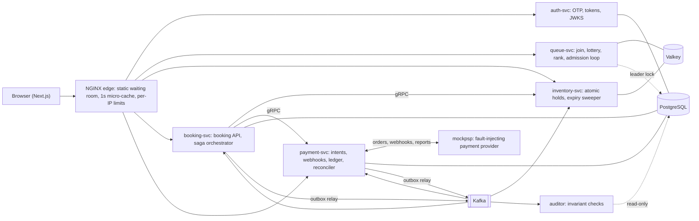
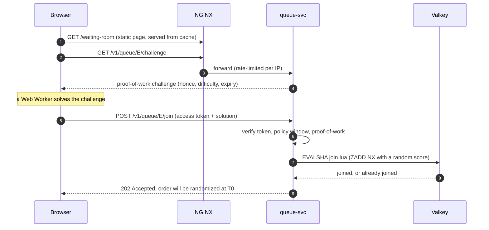
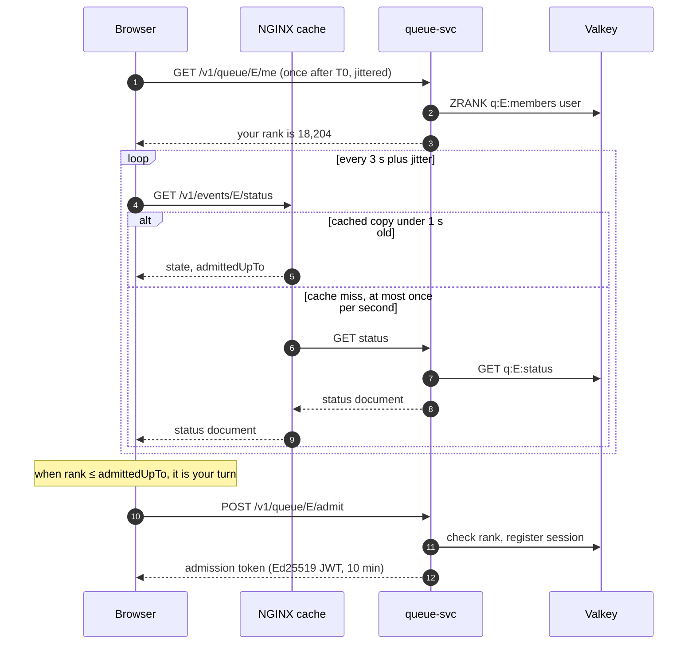
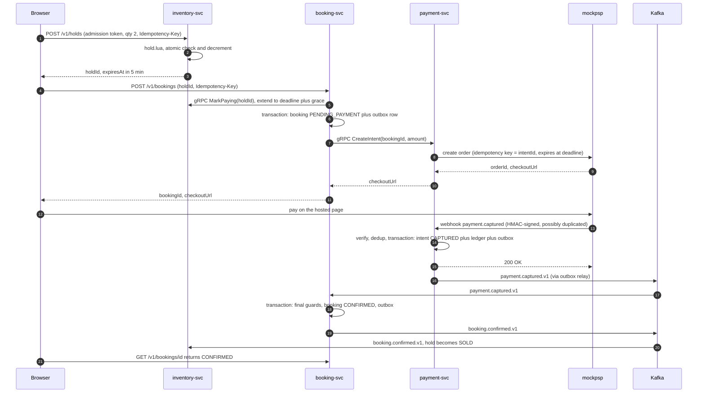
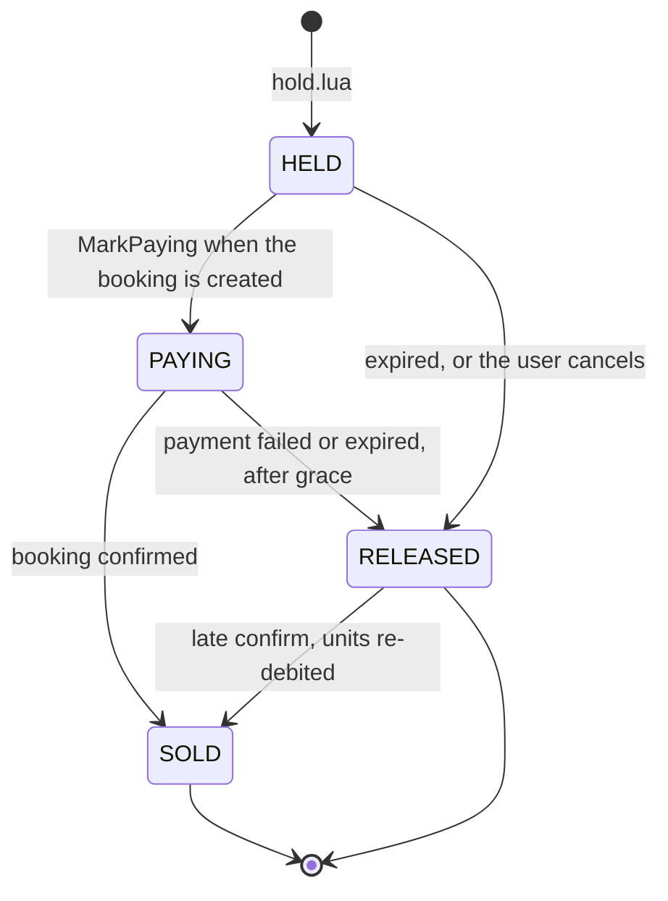
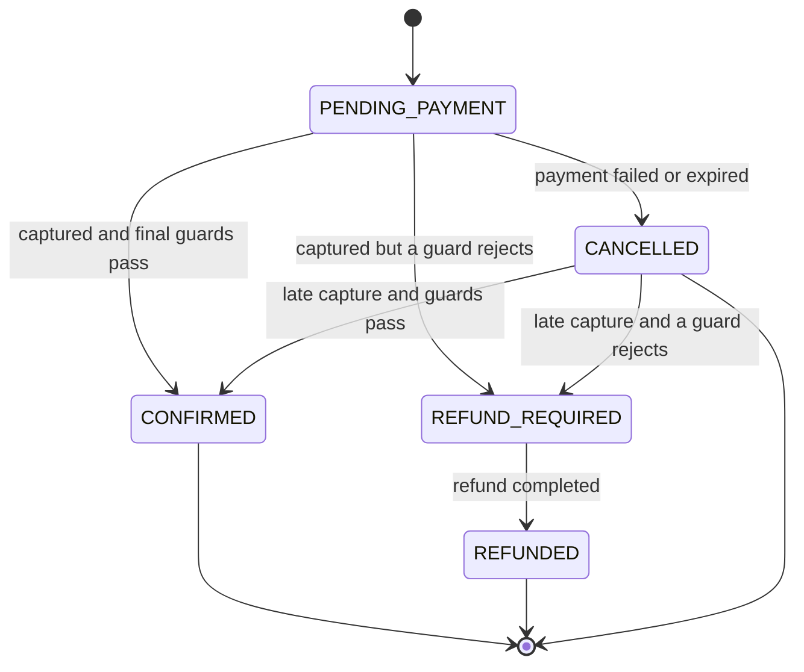
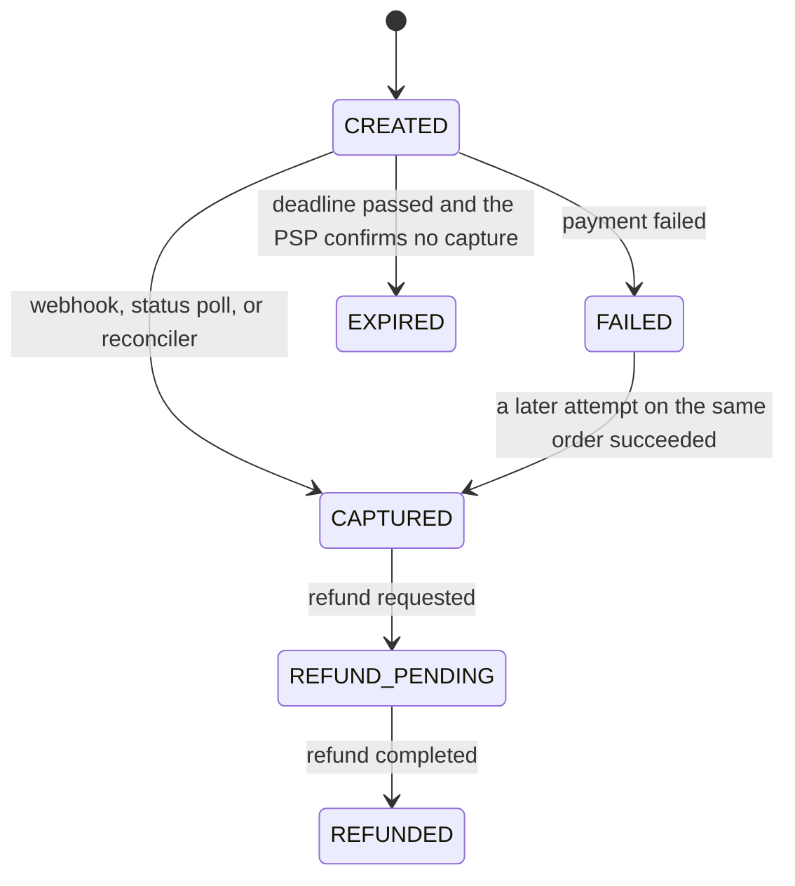
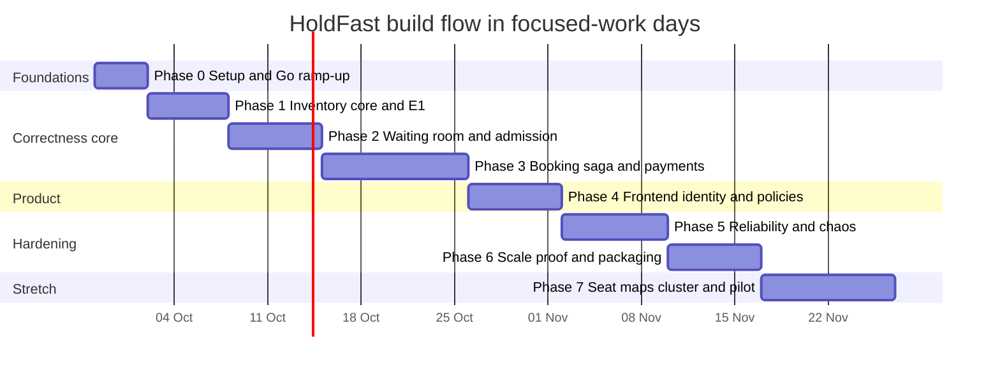

export const Callout = ({ type = 'note', title, children }) => {
  const colors = { note: '#2563eb', tip: '#16a34a', warn: '#d97706', danger: '#dc2626' };
  const c = colors[type] || colors.note;
  return (
    <div style={{ borderLeft: `4px solid ${c}`, padding: '0.6rem 1rem', margin: '1.25rem 0', background: 'rgba(127,127,127,0.08)', borderRadius: '0 8px 8px 0' }}>
      {title ? <p style={{ margin: '0 0 0.4rem', fontWeight: 600 }}>{title}</p> : null}
      <div>{children}</div>
    </div>
  );
};

# HoldFast: a surge-proof booking engine

**In one line:** a booking backend that stays **fair**, **never oversells**, and **never loses a customer's money** when a million people press "Book" in the same minute. It is the IRCTC Tatkal and Coldplay-on-BookMyShow problem, solved with production-grade distributed-systems engineering.

<Callout type="tip" title="How to use this document">

1. Read sections 0 to 5 once, end to end, before writing any code. They explain what we build and why.
2. Sections 6 to 16 are the engineering reference to keep open while building.
3. Section 6 is **Part A of the flow**: what happens at runtime when someone buys. Section 17 is **Part B of the flow**: what we build, in what order, with exit criteria. Section 18 is exactly what to do on day 1.
4. Every decision here is an interview talking point. If you can't explain a line, that is the next thing to study.

Rendering: works in MDX setups with GFM tables and frontmatter (Docusaurus, Nextra, Astro). Mermaid diagrams need a Mermaid plugin, for example `@docusaurus/theme-mermaid`.

</Callout>

## Contents

0. TL;DR
1. Why this problem is real
2. Requirements, invariants and SLOs
3. Capacity model
4. Tech stack: what we use and why
5. Architecture
6. Runtime flow (Part A)
7. State machines
8. Data design
9. Core algorithms, with code
10. APIs
11. Security and abuse prevention
12. Observability
13. Testing strategy and the six experiments
14. Failure modes and runbooks
15. Repository layout and ADRs
16. Local development, CI/CD and deployment
17. Build flow, phase by phase (Part B)
18. Day 1: start here
19. README and demo video
20. Interview talking points
21. Resume bullets
22. Guardrails
23. References

---

## 0. TL;DR

| Question | Answer |
|---|---|
| What is it? | A flash-sale booking engine: waiting room → admission control → atomic holds → payment saga → confirmation or automatic refund. |
| What makes it hard? | Around 1M users arrive within minutes for about 50k units. Everything must stay correct under contention, retries, crashes, and duplicate, delayed or lost payment callbacks. |
| The core idea | Separate **waiting** (cheap, cacheable, massive) from **buying** (expensive, correct, admission-controlled). |
| Hard guarantees | Zero oversell. Zero double charge. Every captured payment ends in a ticket or an automatic refund. Fair ordering. |
| Stack | Go 1.27 services, PostgreSQL 18, Valkey 9.1, Apache Kafka 4.3, gRPC, NGINX, Next.js 16.3, OpenTelemetry, Prometheus, Grafana, k6 v2, Docker and Kubernetes. |
| Proof | Six experiments (contention, waiting-room spike, payment chaos, infrastructure chaos, scale-out, fairness) with published numbers and hardware specs. |

---

## 1. Why this problem is real

- **Concert drops.** On 22 September 2024, around 13 million people logged in to BookMyShow for roughly 1.8 lakh Coldplay tickets. Tickets sold out in about 30 minutes and quickly appeared on resale sites at inflated prices. Fans reported crashes, being logged out as the sale opened, and enormous queues. [1] [2]
- **Railway Tatkal.** From 1 July 2025, only Aadhaar-authenticated users can book Tatkal online. OTP verification became mandatory from 15 July 2025, and agents are blocked for the first 30 minutes of the window, explicitly to curb bots and bulk booking. From 1 October 2025, the Aadhaar-only rule also covers the first 15 minutes of general reservations. [3] [4] [5]
- **Money safety.** RBI's 2019 framework sets deadlines for reversing failed transactions and requires compensation of ₹100 per day of delay, paid without the customer having to complain. [6]
- **Big-tech scale.** During Prime Day 2025, Amazon DynamoDB peaked at 151 million requests per second. [7]
- **Security framing.** OWASP API Security Top 10 (2023) lists *Unrestricted Access to Sensitive Business Flows* (API6). Its example of a sensitive flow is buying a ticket. [8]

HoldFast turns each of these facts into an engineering requirement.

---

## 2. Requirements, invariants and SLOs

### 2.1 Functional requirements

1. Users verify identity with a mock phone OTP and log in.
2. Before the sale opens (T0), users join a **waiting room**. Everyone who joins before T0 gets a **random** position. Later joiners are **FIFO**.
3. The system **admits** users from the queue into a checkout session at a controlled rate.
4. Admitted users **hold** units for a limited time. Quantity mode first; seat-map mode is a Phase 7 stretch.
5. Users **pay** through a payment provider (our mock PSP). Success confirms the ticket. Failure or timeout releases the hold and returns inventory to the pool.
6. Policies: per-user cap (default 4), verified-users-only opening window, agent lockout window, and a freeze switch.
7. Operations: live dashboard, invariant auditor, reconciliation against the PSP, and runbooks.

### 2.2 Non-goals

- Real payments, real Aadhaar/UIDAI integration, real SMS. All mocked; see section 22.
- Resale marketplace, dynamic pricing, recommendations, and fancy seat-map rendering.
- Multi-region active-active. Section 20 covers the design discussion only.

### 2.3 The invariants: never violated, always measured

| ID | Invariant | Enforced by | Verified by |
|---|---|---|---|
| I1 | **No oversell:** confirmed units never exceed capacity; a seat is sold at most once. | Atomic Lua holds (fast path) plus a PostgreSQL conditional update or primary key (final guard). | Contention test, auditor query, Prometheus gauge. |
| I2 | **No double charge:** at most one captured payment per booking. | Idempotency keys at three layers, `UNIQUE(booking_id)` on payment intents, webhook dedup. | Payment chaos test, auditor. |
| I3 | **Money safety:** every captured payment ends CONFIRMED or REFUNDED within 15 minutes. | Saga with compensation, plus the reconciler. | Payment chaos test, SLO alert. |
| I4 | **Per-user cap:** held plus sold units per user per event never exceed the limit. | Lua counter plus a PostgreSQL conditional upsert. | Property tests, auditor. |
| F1 | **Fairness:** pre-T0 order is uniformly random, post-T0 order is FIFO, one slot per identity. | `ZADD NX` with server-side crypto-random scores. | Fairness statistical test (E6). |

### 2.4 Service-level objectives

These are design targets. Section 13 describes how each one is validated.

| SLI | Target |
|---|---|
| Queue status endpoint, p99 at the edge | ≤ 50 ms |
| Join-queue API, p99 | ≤ 150 ms at design load |
| Hold API, p99 | ≤ 100 ms |
| Create-booking API, p99 (excluding PSP time) | ≤ 300 ms |
| Payment captured → booking confirmed, p99 | ≤ 5 s |
| Availability of join and status during the sale window | 99.9% |
| Violations of I1 to I4 | 0 |

---

## 3. Capacity model

**Design point:** one event, 50,000 units, 1,000,000 users arriving within about 5 minutes of T0.

### 3.1 The key insight

Most of the million users are **waiting**, not **buying**. Waiting must cost almost nothing, and buying must be correct. So:

- The waiting room is a **static page** plus a **tiny status document** that is identical for everyone and cached for 1 second at the edge.
- Each client learns its own queue rank once, then compares it locally with `admittedUpTo` from the status document.
- Only admitted users ever touch the expensive, stateful services.

### 3.2 Traffic estimate

| Flow | Estimate | Lands on |
|---|---|---|
| Join queue | 1M joins; about 17k per second averaged over the first minute, with far higher bursts right at T0 | NGINX rate limit → queue-svc → Valkey `ZADD` |
| Status polling | 1M clients polling every 3 s ≈ **333k requests per second** | Edge micro-cache; origin sees about **1 request per second per cache node** |
| Rank lookup | once per user after T0, jittered over 30 s ≈ 33k per second | queue-svc → `ZRANK` |
| Admissions | about 83 per second (see 3.3) | queue-svc |
| Holds | about 3 attempts per admitted user ≈ 250 per second | inventory-svc → Lua |
| Confirmations | at most admissions × conversion rate | PostgreSQL: one hot row per event, which is fine at this rate |

### 3.3 Sizing admission with Little's Law

Little's Law: **L = λ × W**. Items in the system equal arrival rate times time spent in the system.

- Allow **L = 10,000** concurrent checkout sessions. This is a tunable knob.
- An average session (select, hold, pay) lasts **W ≈ 120 s**.
- Sustainable admission rate: **λ = L / W ≈ 83 users per second**.

A second limiter stops us from admitting 10,000 people to fight over the last 100 units. Admit at most `remaining_units × oversubscription_factor`, starting the factor at 1.3 and tuning it from the observed conversion rate.

### 3.4 What we will actually test on a laptop

You can't generate a million real clients at home, and you don't need to. The plan in section 13:

1. Measure single-node capacity for each hot path and **state the hardware**.
2. Show near-linear scaling from 1 to 2 to 4 instances, up to a named bottleneck such as Valkey CPU.
3. Extrapolate using the model above. This is how production engineers argue about scale.

---

## 4. Tech stack: what we use and why

Versions below are the current stable lines as of September 2026 (sources in section 23). On day 1, pin exact patch versions in `go.mod`, `package.json` and every image tag, then let Renovate or Dependabot bump them.

### 4.1 Core platform

| Layer | Choice | Purpose in HoldFast | Why this, and not the alternative |
|---|---|---|---|
| Service language | **Go 1.27** | Every backend service and tool | Goroutines make tens of thousands of concurrent connections cheap; low memory; one static binary per service; a strong standard library (`net/http`, `log/slog`, `testing/synctest`). Uber built its highest-QPS service, geofence lookups, in Go [9]. Java 25 with Spring Boot 4 is a valid alternative (4.6). |
| Source of truth | **PostgreSQL 18** | Bookings, payments, ledger, outbox, users, inventory totals | ACID transactions give the final guard against oversell. `FOR UPDATE SKIP LOCKED` for work queues, advisory locks for leader election, and the built-in `uuidv7()` for time-ordered, index-friendly keys [10]. |
| Hot state | **Valkey 9.1** (Redis-compatible; Redis 8 also works) | Waiting-room queue, holds, counters, rate limits, idempotency cache | In-memory atomic Lua scripts handle thousands of contended operations per second with no row locks. BSD-licensed and wire-compatible with Redis [11]. |
| Event backbone | **Apache Kafka 4.3** (KRaft mode, no ZooKeeper) | Domain events between services; replayable audit trail | Durable, ordered per key (`booking_id`), consumer groups, replay for the auditor. RabbitMQ and SQS don't give replay; Redis Streams would put events on the same failure domain as hot state [12]. |
| Sync RPC | **gRPC + Protocol Buffers** (managed with the Buf CLI) | Internal calls: booking → inventory, booking → payment | Typed contracts; deadlines and cancellation propagate across services; standard practice at Google and Uber scale. |
| Edge | **NGINX** | Static waiting room, 1-second micro-cache, per-IP rate limits, routing | `proxy_cache_lock` collapses thousands of identical requests into one origin request. In production this role is a CDN such as Cloudflare or CloudFront. |
| Frontend | **Next.js 16.3** with TypeScript and Tailwind CSS | Waiting room, rank and countdown, checkout, booking status | Static export for the waiting room so it can be served from cache; you already know React and Next. Always apply the latest patch, because Next.js now ships regular security releases [13]. |

### 4.2 Go libraries

| Concern | Library | Notes |
|---|---|---|
| HTTP | standard `net/http` (method and wildcard routing) | No framework. Write small middleware yourself: auth, logging, metrics, panic recovery. |
| gRPC | `google.golang.org/grpc` with Buf-generated code | Interceptors for auth, tracing, metrics and deadlines. |
| PostgreSQL | `jackc/pgx/v5` + **sqlc** | sqlc generates type-safe Go from hand-written SQL. No ORM: you own every query and every lock. |
| Migrations | `pressly/goose` | Plain SQL migrations, one folder per service schema. |
| Valkey / Redis | `redis/go-redis/v9` | Works with Valkey (`valkey-io/valkey-go` is an alternative). Load Lua once, call with `EVALSHA`. |
| Kafka | `twmb/franz-go` | Pure Go, idempotent producer, fast consumer groups. |
| Tokens and crypto | `golang-jwt/jwt/v5`, standard `crypto/ed25519`, `crypto/hmac` | EdDSA-signed tokens; constant-time HMAC comparison for webhooks. |
| Resilience | `sony/gobreaker`, `cenkalti/backoff` | Circuit breaker plus exponential backoff with jitter for the PSP client. |
| Observability | OpenTelemetry Go SDK (`otelhttp`, `otelgrpc`), `prometheus/client_golang` | Traces and metrics; the W3C `traceparent` header travels through gRPC metadata and Kafka headers. |
| Logging | standard `log/slog` with the JSON handler | Structured logs with a `trace_id` on every line. |
| Testing | standard `testing` and `testing/synctest`, `testcontainers-go`, `pgregory.net/rapid`, `stretchr/testify` | Fake-clock time tests, real PostgreSQL/Valkey/Kafka in tests, property-based tests. |
| Config | `caarlos0/env` | 12-factor configuration from environment variables. |
| Ops CLI | `spf13/cobra` | `holdfastctl` for freezes, rebuilds, DLQ replay and manual refunds. |

### 4.3 Infrastructure, observability and tooling

| Concern | Tool | Purpose |
|---|---|---|
| Local orchestration | Docker Compose | One command brings everything up (`make up`). |
| Kubernetes (Phase 6) | kind plus Kustomize or Helm; Strimzi (Kafka operator); CloudNativePG (PostgreSQL operator) | Autoscaling (HPA), rolling deploys, PodDisruptionBudgets. |
| Metrics and dashboards | Prometheus 3 + Grafana | RED metrics, invariant gauges, SLO alerts, the "mission control" dashboard. |
| Tracing | OpenTelemetry Collector → Jaeger v2 (or Grafana Tempo) | One trace from "click Book" through Kafka to "confirmed". |
| Logs | JSON to stdout → Grafana Loki (optional) | Correlate logs with trace IDs. |
| Load testing | **k6 v2** | Spike, soak, contention and polling scenarios with arrival-rate executors [14]. |
| Fault injection | **Toxiproxy** plus container kills | Latency, timeouts and partitions between services and dependencies. |
| Kafka UI | Redpanda Console | Inspect topics, consumer lag and messages. |
| CI | GitHub Actions | Lint, `go test -race`, integration tests, image builds, Trivy scans, `govulncheck`. |
| Code quality | golangci-lint, `buf lint`, `buf breaking` | Style and bug checks; protobuf backward-compatibility checks. |
| Profiling | `net/http/pprof`, `go tool trace` | Find CPU and allocation hotspots before you publish performance numbers. |

### 4.4 What we build ourselves, on purpose

| Component | Why build instead of buy |
|---|---|
| Mock payment provider (`mockpsp`) | Real PSP sandboxes can't inject the failures we must survive: duplicate, delayed, out-of-order and lost webhooks, timeouts, and "captured but the callback never arrived". |
| Admission controller | The heart of the system and the best interview story. Your existing token bucket becomes one of its limiters. |
| Transactional outbox relay | Shows you understand the dual-write problem. Debezium CDC is a Phase 7 upgrade. |
| Saga orchestrator | Shows the mechanics. Temporal (which descends from Uber's Cadence) is the production-grade alternative; an ADR explains the trade-off. |
| Invariant auditor | Continuous proof that I1 to I4 hold. This is what makes your numbers believable. |

### 4.5 Deliberately not used

- **No ML or AI.** City Brain covers that; this project is pure systems engineering.
- **No ORM.** You need explicit SQL to reason about locks and constraints.
- **No service mesh** (Istio, Linkerd). It adds operational weight without teaching the core problems. Say "I'd add one at 50+ services".
- **No NoSQL primary database.** The correctness core needs transactions and constraints.

### 4.6 If you choose Java instead of Go

| Go choice | Java equivalent |
|---|---|
| Go 1.27 | Java 25 (LTS) with virtual threads |
| `net/http` + grpc-go | Spring Boot 4 (Spring MVC on virtual threads) + grpc-java |
| pgx + sqlc | JDBC + jOOQ (type-safe SQL) |
| go-redis | Lettuce |
| franz-go | Official Kafka Java client or Spring for Apache Kafka |
| testcontainers-go, rapid | Testcontainers for Java, jqwik |

The design, invariants and experiments in this document stay exactly the same.

---

## 5. Architecture

### 5.1 System overview



### 5.2 Services

| Service | Responsibility | Owns | Scales on | If it dies |
|---|---|---|---|---|
| `queue-svc` | Join, lottery freeze at T0, ranks, the status document, the admission control loop (leader-elected), admission tokens | Valkey `q:*` and `adm:*` keys | Joins and rank lookups per second | Clients keep seeing the last cached status; admissions pause; no correctness impact. |
| `inventory-svc` | Atomic hold, mark-paying, confirm, release; expiry sweeper; availability snapshots | Valkey `inv:*` keys | Holds per second | New holds fail fast; existing holds are safe because their state lives in Valkey. |
| `booking-svc` | Booking API with idempotency, saga orchestration, confirmation with final guards, compensation | `booking` schema | Bookings per second, Kafka partitions | Checkout returns 503 with Retry-After; holds in PAYING state are protected; the saga resumes from database state. |
| `payment-svc` | Payment intents, PSP client (breaker, retries), webhooks (HMAC, dedup), ledger, status polling, reconciliation | `payment` schema | Webhooks per second | The PSP retries webhooks; the reconciler fills any gaps. |
| `auth-svc` | OTP with mock SMS, access and refresh tokens, JWKS, roles | `auth` schema | Logins per second | New logins fail; existing access tokens stay valid until expiry. |
| `mockpsp` | Stand-in payment provider with fault injection, a hosted checkout page and settlement reports | In-memory, resettable between runs | n/a | Simulates a PSP outage, which is itself a test scenario. |
| `auditor` | Continuously evaluates I1 to I4 and exports them as gauges | Read-only database role | n/a | No user impact; an alert fires if its data goes stale. |
| `web` | Next.js buyer app | n/a | Edge cache | The static waiting room is still served from cache. |

### 5.3 Why these boundaries

- **Split by scaling profile and failure domain, not by nouns.** The hot path (queue, inventory) lives on Valkey and must absorb spikes. The correctness path (booking, payment) lives on PostgreSQL and must never lose data.
- **Payments are isolated** because they touch money and an external dependency with its own failure modes.
- **Auth is isolated** so signing keys and credentials sit in one small, auditable service.
- **Seven binaries in one Go monorepo, not twenty microservices.** Shared `internal/platform` code, independent deployables. This is a deliberate trade-off worth defending in interviews.

---

## 6. Runtime flow (Part A): what happens when someone buys

### 6.1 Timing constants

| Constant | Value | Reason |
|---|---|---|
| `HOLD_TTL` | 5 min | Time to review the selection and press Pay. |
| `PAYMENT_DEADLINE` | 7 min after the booking is created | The PSP order is set to expire at the same instant. |
| `GRACE` | 3 min | Absorbs delayed webhooks. A PAYING hold survives until deadline plus grace. |
| `SESSION_TTL` | 10 min, extended when a booking starts | Concurrency accounting for admission control. |
| `STATUS_CACHE` | 1 s | Freshness versus origin load. |
| `CLIENT_POLL` | 3 s plus 0 to 1 s of random jitter | Prevents synchronized waves of requests. |
| `ADMISSION_TICK` | 250 ms | Smooth, frequent admission steps. |
| `SWEEP_INTERVAL` | 500 ms | Prompt release of expired holds. |

Tune `PAYMENT_DEADLINE` from measured PSP checkout latency. If p99 checkout takes 4 minutes, 7 minutes gives headroom.

### 6.2 Step 1: joining before the sale opens



### 6.3 Step 2: after T0, waiting for your turn



### 6.4 Step 3: hold, pay, confirm



### 6.5 When things go wrong

| Situation | What happens | Invariant protected |
|---|---|---|
| Payment fails (`payment.failed` webhook) | Booking becomes CANCELLED → `booking.cancelled.v1` → inventory releases the hold → the admission controller sees units return and admits more people. | I1, with capacity reused |
| User abandons at the PSP | The PSP order expires at the deadline → payment-svc polls status → `payment.expired.v1` → booking CANCELLED → hold released. | I1 |
| The same webhook arrives three times | Dedup on `psp_event_id`; later copies return 200 with no side effects. | I2 |
| Webhooks arrive out of order (failed after captured) | The state machine refuses to move CAPTURED backwards. | I2, I3 |
| A webhook is lost entirely | The deadline job polls the PSP; the reconciler diffs the settlement report; the capture is applied through the same idempotent path. | I3 |
| The capture arrives after the hold expired | The PostgreSQL final guard decides: capacity available → confirm (Valkey re-debits the units); otherwise REFUND_REQUIRED → automatic refund. | I1, I3 |
| Client retries `POST /v1/bookings` after a timeout | Same Idempotency-Key → same booking, same intent, same checkout URL. | I2 |
| booking-svc crashes mid-saga | State lives in PostgreSQL and the outbox; consumers resume from committed offsets; the deadline job finishes stragglers. | I2, I3 |
| Kafka is down | Outbox rows accumulate safely in PostgreSQL and drain when Kafka returns; PAYING holds are protected by the grace window. | I3 |
| Valkey fails over and loses the last ~1 s of writes | Admission pauses automatically; counters are rebuilt from PostgreSQL; the final guard prevents oversell. | I1 |
| The PSP is down | The circuit breaker opens → create-booking returns 503 with Retry-After → the admission controller stops admitting (backpressure). | Availability |

---

## 7. State machines

Transitions only move forward. Every transition is enforced with a guarded update (`WHERE status IN (...)`) so a stale or duplicate message can never move state backwards.

### 7.1 Hold (Valkey)



### 7.2 Booking (PostgreSQL)



Late-capture policy: if the customer paid, honor the payment when the final guards allow it; otherwise refund automatically. Count both outcomes in `holdfast_late_confirm_total`.

### 7.3 Payment intent (PostgreSQL)



A capture reported by the PSP always wins, because money actually moved.

---

## 8. Data design

### 8.1 PostgreSQL: one schema per service

Each service owns its schema and connects with its own least-privilege role. Locally, all schemas share one PostgreSQL instance; in production they can move to separate clusters without code changes. The auditor gets a read-only role across schemas.

```sql
-- ===== schema: booking (owned by booking-svc) =====
CREATE SCHEMA IF NOT EXISTS booking;

CREATE TABLE booking.events (
  id                      uuid PRIMARY KEY DEFAULT uuidv7(),
  name                    text        NOT NULL,
  sale_opens_at           timestamptz NOT NULL,
  verified_window_ends_at timestamptz,   -- verified users only until this instant
  agent_lockout_ends_at   timestamptz,   -- AGENT role blocked until this instant
  per_user_limit          smallint    NOT NULL DEFAULT 4 CHECK (per_user_limit BETWEEN 1 AND 10),
  unit_price_paise        bigint      NOT NULL CHECK (unit_price_paise > 0),
  status                  text        NOT NULL DEFAULT 'SCHEDULED'
                          CHECK (status IN ('SCHEDULED','OPEN','FROZEN','SOLD_OUT','CLOSED'))
);

-- Final guard for quantity mode (I1): one row per event.
CREATE TABLE booking.event_inventory (
  event_id   uuid PRIMARY KEY REFERENCES booking.events(id),
  capacity   integer     NOT NULL CHECK (capacity >= 0),
  sold       integer     NOT NULL DEFAULT 0,
  updated_at timestamptz NOT NULL DEFAULT now(),
  CONSTRAINT no_oversell CHECK (sold BETWEEN 0 AND capacity)
);

-- Final guard for the per-user cap (I4).
CREATE TABLE booking.user_event_purchases (
  event_id uuid    NOT NULL REFERENCES booking.events(id),
  user_id  uuid    NOT NULL,
  qty      integer NOT NULL CHECK (qty >= 0),
  PRIMARY KEY (event_id, user_id)
);

CREATE TABLE booking.bookings (
  id               uuid PRIMARY KEY DEFAULT uuidv7(),
  event_id         uuid        NOT NULL REFERENCES booking.events(id),
  user_id          uuid        NOT NULL,
  hold_id          text        NOT NULL UNIQUE,    -- at most one booking per hold
  qty              integer     NOT NULL CHECK (qty > 0),
  amount_paise     bigint      NOT NULL CHECK (amount_paise > 0),  -- integer paise, never float
  status           text        NOT NULL
                   CHECK (status IN ('PENDING_PAYMENT','CONFIRMED','CANCELLED','REFUND_REQUIRED','REFUNDED')),
  payment_deadline timestamptz NOT NULL,
  version          integer     NOT NULL DEFAULT 0, -- optimistic concurrency
  created_at       timestamptz NOT NULL DEFAULT now(),
  updated_at       timestamptz NOT NULL DEFAULT now()
);
CREATE INDEX bookings_deadline_idx ON booking.bookings (payment_deadline)
  WHERE status = 'PENDING_PAYMENT';

-- Seat-map mode (Phase 7): the primary key makes selling one seat twice impossible.
CREATE TABLE booking.sold_seats (
  event_id   uuid NOT NULL,
  seat_id    text NOT NULL,
  booking_id uuid NOT NULL REFERENCES booking.bookings(id),
  PRIMARY KEY (event_id, seat_id)
);

-- Stripe-style idempotency for the public API.
CREATE TABLE booking.idempotency_keys (
  user_id       uuid        NOT NULL,
  idem_key      text        NOT NULL,
  request_hash  bytea       NOT NULL,   -- SHA-256 of method, path and body
  status        text        NOT NULL CHECK (status IN ('IN_PROGRESS','COMPLETED')),
  booking_id    uuid,
  response_code smallint,
  response_body jsonb,
  created_at    timestamptz NOT NULL DEFAULT now(),
  PRIMARY KEY (user_id, idem_key)
);

-- Every service schema has these two tables.
CREATE TABLE booking.outbox (
  id           bigint GENERATED ALWAYS AS IDENTITY PRIMARY KEY,
  aggregate_id uuid        NOT NULL,              -- becomes the Kafka message key
  event_type   text        NOT NULL,              -- e.g. booking.confirmed.v1
  payload      bytea       NOT NULL,              -- protobuf
  headers      jsonb       NOT NULL DEFAULT '{}', -- traceparent and ce_* attributes
  created_at   timestamptz NOT NULL DEFAULT now(),
  published_at timestamptz
);
CREATE INDEX outbox_unpublished_idx ON booking.outbox (id) WHERE published_at IS NULL;

CREATE TABLE booking.processed_messages (
  consumer     text        NOT NULL,
  message_id   text        NOT NULL,   -- the ce_id header of the Kafka message
  processed_at timestamptz NOT NULL DEFAULT now(),
  PRIMARY KEY (consumer, message_id)
);
```

```sql
-- ===== schema: payment (owned by payment-svc) =====
CREATE SCHEMA IF NOT EXISTS payment;

CREATE TABLE payment.payment_intents (
  id             uuid PRIMARY KEY DEFAULT uuidv7(),
  booking_id     uuid        NOT NULL UNIQUE,   -- I2: one intent per booking
  amount_paise   bigint      NOT NULL CHECK (amount_paise > 0),
  currency       char(3)     NOT NULL DEFAULT 'INR',
  status         text        NOT NULL
                 CHECK (status IN ('CREATED','CAPTURED','FAILED','EXPIRED','REFUND_PENDING','REFUNDED')),
  psp_order_id   text UNIQUE,
  psp_payment_id text UNIQUE,
  expires_at     timestamptz NOT NULL,
  created_at     timestamptz NOT NULL DEFAULT now(),
  updated_at     timestamptz NOT NULL DEFAULT now()
);

CREATE TABLE payment.psp_webhook_events (
  psp_event_id text PRIMARY KEY,   -- dedup key: a duplicate insert becomes a no-op
  event_type   text        NOT NULL,
  received_at  timestamptz NOT NULL DEFAULT now(),
  payload      jsonb       NOT NULL
);

-- Double-entry ledger: in every transaction, total debits equal total credits.
CREATE TABLE payment.ledger_entries (
  id           bigint GENERATED ALWAYS AS IDENTITY PRIMARY KEY,
  txn_id       uuid        NOT NULL,
  account      text        NOT NULL,   -- psp_receivable, unearned_revenue:EVENT_ID, bank
  direction    char(1)     NOT NULL CHECK (direction IN ('D','C')),
  amount_paise bigint      NOT NULL CHECK (amount_paise > 0),
  intent_id    uuid        NOT NULL REFERENCES payment.payment_intents(id),
  created_at   timestamptz NOT NULL DEFAULT now()
);
CREATE INDEX ledger_txn_idx ON payment.ledger_entries (txn_id);

-- plus payment.outbox and payment.processed_messages, same shape as in booking
```

| Money movement | Debit | Credit |
|---|---|---|
| Customer payment captured | `psp_receivable` | `unearned_revenue:E` |
| Refund issued | `unearned_revenue:E` | `psp_receivable` |
| PSP settles to our bank account | `bank` | `psp_receivable` |

```sql
-- ===== schema: auth (owned by auth-svc) =====
CREATE SCHEMA IF NOT EXISTS auth;

CREATE TABLE auth.users (
  id                uuid PRIMARY KEY DEFAULT uuidv7(),
  phone_hmac        bytea       NOT NULL UNIQUE,  -- HMAC-SHA256(pepper, phone): lookup without storing the number
  phone_last4       char(4)     NOT NULL,
  phone_verified_at timestamptz,
  role              text        NOT NULL DEFAULT 'BUYER' CHECK (role IN ('BUYER','AGENT','ADMIN')),
  created_at        timestamptz NOT NULL DEFAULT now()
);

CREATE TABLE auth.otp_challenges (
  id          uuid PRIMARY KEY DEFAULT uuidv7(),
  phone_hmac  bytea       NOT NULL,
  code_hash   bytea       NOT NULL,   -- never store the code itself
  attempts    smallint    NOT NULL DEFAULT 0,
  expires_at  timestamptz NOT NULL,
  consumed_at timestamptz
);

CREATE TABLE auth.refresh_tokens (
  token_hash  bytea PRIMARY KEY,      -- SHA-256 of the opaque token
  user_id     uuid        NOT NULL REFERENCES auth.users(id),
  family_id   uuid        NOT NULL,   -- rotation chain; reusing an old token revokes the whole family
  replaced_by bytea,
  revoked_at  timestamptz,
  expires_at  timestamptz NOT NULL,
  created_at  timestamptz NOT NULL DEFAULT now()
);
```

### 8.2 Valkey keyspace

Every key for event E carries the hash tag `{E}`, so all keys a script touches live in the same cluster slot. Scripts must declare every key they touch, which is why the expiry index stores members shaped like `holdID|userID`.

| Key | Type | Purpose | Lifetime |
|---|---|---|---|
| `q:{E}:state` | string | PRE, OPEN, FROZEN, SOLD_OUT or CLOSED | event |
| `q:{E}:members` | sorted set | user → score: a random value between 0 and 1 before T0, then 1 plus a sequence number | event |
| `q:{E}:seq` | integer | post-T0 arrival counter | event |
| `q:{E}:admitted` | integer | `admittedUpTo`, the highest admitted rank | event |
| `q:{E}:status` | string (JSON) | the status document every client polls | rewritten every tick |
| `adm:{E}:epoch` | integer | leader fencing token | event |
| `adm:{E}:sessions` | sorted set | session → expiry in ms, for concurrency accounting | event |
| `inv:{E}:avail` | integer | units available to hold | event |
| `inv:{E}:user:U` | integer | units held plus sold by user U, for I4 | event |
| `inv:{E}:hold:H` | hash | user, qty, state, expires_at | tombstone kept 1 hour after release |
| `inv:{E}:expiry` | sorted set | hold-and-user member → expiry in ms (sweeper index) | event |
| `rl:SCOPE:ID` | hash | token-bucket state: tokens and last refill | auto-expiring |
| `jti:ID` | string | spent one-time token IDs, for replay protection | token lifetime |

- **A deliberate hot key.** One event's inventory lives on one shard. Admission control caps that traffic at a few hundred operations per second, so this is fine. Seat-map mode (Phase 7) shards by section with tags like `{E:S}`.
- **Durability.** AOF with `appendfsync everysec`, plus a replica and Sentinel in Phase 5. A crash can lose roughly the last second of writes, which is exactly why PostgreSQL owns the final guard and why runbook RB-2 exists.
- **Memory.** One million queue members at roughly 100 bytes each is about 100 MB. Compact user IDs (16 raw bytes instead of a 36-character UUID string) shrink that a lot.

### 8.3 Kafka topics and event contracts

| Topic | Key | Producer | Consumers | Event types |
|---|---|---|---|---|
| `holdfast.booking.v1` | booking_id | booking-svc, via outbox | inventory-svc, payment-svc, auditor | booking.created, booking.confirmed, booking.cancelled, booking.refund_required |
| `holdfast.payment.v1` | booking_id | payment-svc, via outbox | booking-svc, auditor | payment.captured, payment.failed, payment.expired, refund.completed |
| `holdfast.inventory.v1` | event_id | inventory-svc, direct | queue-svc, auditor | inventory.changed (snapshot), hold.released |
| `*.dlq.v1` | original key | any consumer after N failed retries | humans, via an alert | poison messages |

- **Partitions:** 6 locally, 24 or more in production. Keying by `booking_id` keeps every event of one booking in order on one partition.
- **Replication:** factor 1 locally; 3 in production with `min.insync.replicas=2`.
- **Producers:** `acks=all` with idempotence enabled.
- **Consumers:** commit offsets only after the database transaction that applied the message has committed.
- **inventory-svc publishes directly**, without an outbox, because its events are informational snapshots. Correctness never depends on them.

Every message carries CloudEvents attributes as Kafka headers (binary content mode) and a Protobuf payload:

```proto
// proto/events/v1/payment.proto
syntax = "proto3";
package holdfast.events.v1;

import "google/protobuf/timestamp.proto";

message PaymentCaptured {
  string booking_id     = 1;
  string intent_id      = 2;
  string psp_payment_id = 3;
  int64  amount_paise   = 4;
  google.protobuf.Timestamp captured_at = 5;
}
```

| Header | Example | Used for |
|---|---|---|
| `ce_specversion` | `1.0` | CloudEvents version |
| `ce_id` | a UUIDv7 | The dedup key for idempotent consumers |
| `ce_type` | `payment.captured.v1` | Routing and decoding |
| `ce_source` | `payment-svc` | Producer identity |
| `ce_time` | an RFC 3339 timestamp | Ordering diagnostics |
| `traceparent` | W3C trace context | One trace across asynchronous hops |

Schema evolution rules: add fields only, never reuse or renumber a field, and let `buf breaking` fail CI on violations. A truly breaking change means a new topic version (`v2`).

---

## 9. Core algorithms, with code

Store every Lua script in `internal/*/scripts/*.lua`, embed it with `go:embed`, load it once with `SCRIPT LOAD`, and call it with `EVALSHA`. Each script runs atomically on the engine's single command thread: no other command can interleave, so check-then-act races are impossible without any locks.

### 9.1 Fair lottery and joining the queue

Under pure FIFO, whoever has the fastest network, the most tabs or a bot wins, and everyone is rewarded for hammering the site early. A lottery for everyone who arrives before T0 removes that incentive. `ZADD NX` makes joining idempotent and stops people re-rolling their position.

```lua
-- join.lua
-- KEYS[1] q:{E}:state   KEYS[2] q:{E}:members   KEYS[3] q:{E}:seq
-- ARGV[1] user_id       ARGV[2] pre-T0 random score as a string, generated server-side
-- Returns {code, score}: 1 joined, 0 already joined (idempotent), -1 closed
local state = redis.call('GET', KEYS[1])
if state == 'SOLD_OUT' or state == 'CLOSED' then return {-1, ''} end

local existing = redis.call('ZSCORE', KEYS[2], ARGV[1])
if existing then return {0, existing} end        -- no re-rolling the lottery

local score
if state == 'OPEN' then
  score = tostring(1 + redis.call('INCR', KEYS[3]))   -- FIFO after T0
else
  score = ARGV[2]                                       -- lottery before T0
end
redis.call('ZADD', KEYS[2], 'NX', score, ARGV[1])
return {1, score}   -- strings, because Lua numbers are truncated to integers in replies
```

```go
// lotteryScore returns a crypto-random float64 in [0, 1) with 53 bits of entropy.
func lotteryScore() (string, error) {
    var b [8]byte
    if _, err := rand.Read(b[:]); err != nil { // crypto/rand, never math/rand
        return "", err
    }
    u := binary.BigEndian.Uint64(b[:]) >> 11 // keep 53 bits: the float64 mantissa size
    f := float64(u) / float64(uint64(1)<<53)
    return strconv.FormatFloat(f, 'g', 17, 64), nil
}
```

- At T0 the admission leader flips `q:{E}:state` from PRE to OPEN. Because scripts are atomic, every join lands unambiguously before or after the flip.
- Rank is `ZRANK q:{E}:members user` plus 1. Before T0 the API returns "randomizing at T0" instead of a rank.
- Joins are still accepted while the sale is FROZEN; only admissions pause.

### 9.2 The admission controller

A control loop runs every 250 ms on exactly one leader per event. Each tick it decides how many more people to admit.

```go
// Leader election with a session-level PostgreSQL advisory lock. Use a DEDICATED
// connection, not one from the pool: a pooled connection would keep holding the
// lock after Release(). If this process dies, the connection drops and PostgreSQL
// releases the lock automatically, so a standby takes over.
func (c *Controller) Run(ctx context.Context) error {
    conn, err := pgx.Connect(ctx, c.dsn)
    if err != nil {
        return err
    }
    defer conn.Close(context.Background())

    for {
        var leader bool
        if err := conn.QueryRow(ctx, `SELECT pg_try_advisory_lock($1)`, c.lockKey).Scan(&leader); err != nil {
            return err
        }
        if leader {
            break
        }
        select { // standby: try again shortly
        case <-ctx.Done():
            return ctx.Err()
        case <-time.After(2 * time.Second):
        }
    }

    epoch, err := c.kv.Incr(ctx, epochKey(c.event)).Result() // fencing token for this term
    if err != nil {
        return err
    }

    tick := time.NewTicker(250 * time.Millisecond)
    defer tick.Stop()
    for {
        select {
        case <-ctx.Done():
            return ctx.Err()
        case <-tick.C:
            if err := conn.Ping(ctx); err != nil {
                return err // lost the lock's connection: step down and re-elect
            }
            if err := c.tick(ctx, epoch); err != nil {
                c.log.Warn("admission tick failed", "err", err)
            }
        }
    }
}

func (c *Controller) tick(ctx context.Context, epoch int64) error {
    s, err := c.store.Snapshot(ctx, c.event) // units, sessions, holds, state, p99, errors, breaker
    if err != nil {
        return err
    }
    switch {
    case s.State == StateFrozen:
        return nil
    case s.Avail <= 0 && s.ActiveHolds == 0:
        return c.store.MarkSoldOut(ctx, c.event, epoch)
    }
    budget := c.cfg.MaxSessions - s.ActiveSessions                        // Little's Law cap (L)
    target := int(float64(s.Avail)*c.oversub.Factor()) - s.ActiveSessions // don't over-admit for few units
    want := max(0, min(budget, target))
    limit := c.aimd.Limit(want, s.CheckoutP99, s.ErrorRate, s.PSPBreakerOpen) // adapt to downstream health
    n := c.bucket.Take(limit)                                                // smooth bursts: your token bucket
    if n == 0 {
        return nil
    }
    return c.store.Advance(ctx, c.event, n, epoch) // advance.lua rejects stale epochs
}
```

```lua
-- advance.lua (fenced)
-- KEYS[1] adm:{E}:epoch   KEYS[2] q:{E}:admitted   KEYS[3] q:{E}:members
-- KEYS[4] q:{E}:status    KEYS[5] q:{E}:state
-- ARGV[1] the caller's epoch   ARGV[2] how many people to admit
if redis.call('GET', KEYS[1]) ~= ARGV[1] then
  return -1                                  -- a stale leader: fenced off
end
local total = redis.call('ZCARD', KEYS[3])
local cur = tonumber(redis.call('GET', KEYS[2]) or '0')
local nxt = math.min(cur + tonumber(ARGV[2]), total)
redis.call('SET', KEYS[2], nxt)
local t = redis.call('TIME')
redis.call('SET', KEYS[4], cjson.encode({
  state = redis.call('GET', KEYS[5]) or 'PRE',
  admittedUpTo = nxt,
  serverTimeMs = t[1] * 1000 + math.floor(t[2] / 1000),
}))
return nxt
```

**Why fencing matters.** A leader can pause (a long GC, a frozen VM) and wake up after a new leader was elected. Its epoch is now stale, so `advance.lua` rejects its writes. This is the fencing-token pattern from Martin Kleppmann's writing on distributed locks.

**AIMD: adaptive admission, like TCP congestion control.**

- While checkout p99 and error rates are within SLO, raise the per-tick admission ceiling by a small constant (additive increase).
- When hold or booking p99 breaches its SLO, the 5xx rate goes above 1%, or the PSP circuit breaker opens, halve the ceiling (multiplicative decrease).
- The system converges on what the downstream can actually handle, instead of trusting a guessed number.

**Admission tokens and sessions.**

```go
now := time.Now()
claims := jwt.MapClaims{
    "sub": userID, "evt": eventID, "sid": sessionID, "rank": rank,
    "aud": "inventory", "iat": now.Unix(), "exp": now.Add(10 * time.Minute).Unix(),
}
tok := jwt.NewWithClaims(jwt.SigningMethodEdDSA, claims)
tok.Header["kid"] = c.keyID                   // key rotation through JWKS
signed, err := tok.SignedString(c.privateKey) // an ed25519.PrivateKey
```

```text
on admit:          ZADD adm:{E}:sessions <expiry_ms> <sid>
active sessions:   ZCOUNT adm:{E}:sessions <now_ms> +inf
every tick:        ZREMRANGEBYSCORE adm:{E}:sessions -inf <now_ms>
booking done/left: ZREM adm:{E}:sessions <sid>
```

### 9.3 Atomic holds

```lua
-- hold.lua (quantity mode)
-- KEYS[1] inv:{E}:avail   KEYS[2] inv:{E}:user:U   KEYS[3] inv:{E}:hold:H   KEYS[4] inv:{E}:expiry
-- ARGV[1] qty   ARGV[2] per_user_limit   ARGV[3] expiry member "H|U"   ARGV[4] user_id   ARGV[5] ttl_ms
-- Returns {code, n}:  1 OK (n = units left)          2 hold already exists (idempotent retry)
--                     0 SOLD_OUT (n = units left)   -1 USER_LIMIT (n = units already used)
--                    -2 BAD_QTY
local qty   = tonumber(ARGV[1])
local limit = tonumber(ARGV[2])
if not qty or qty < 1 or qty > limit then return {-2, 0} end

if redis.call('EXISTS', KEYS[3]) == 1 then            -- same Idempotency-Key, same hold ID
  return {2, tonumber(redis.call('GET', KEYS[1]) or '0')}
end

local used = tonumber(redis.call('GET', KEYS[2]) or '0')
if used + qty > limit then return {-1, used} end

local avail = tonumber(redis.call('GET', KEYS[1]) or '0')
if avail < qty then return {0, avail} end

local t = redis.call('TIME')                          -- one clock for every app instance
local now = t[1] * 1000 + math.floor(t[2] / 1000)
local expires = now + tonumber(ARGV[5])

redis.call('DECRBY', KEYS[1], qty)
redis.call('INCRBY', KEYS[2], qty)
redis.call('HSET', KEYS[3], 'user', ARGV[4], 'qty', qty, 'state', 'HELD', 'expires_at', expires)
redis.call('ZADD', KEYS[4], expires, ARGV[3])
return {1, avail - qty}
```

The hold ID is derived from the user ID and the client's Idempotency-Key (for example a UUIDv5), so a retried request lands on the `EXISTS` branch instead of holding twice. If that existing hold was already released, the API returns 409 and the client retries with a fresh key.

```lua
-- mark_paying.lua: HELD → PAYING, extending expiry to deadline plus grace (idempotent)
-- KEYS[1] inv:{E}:hold:H   KEYS[2] inv:{E}:expiry
-- ARGV[1] expiry member "H|U"   ARGV[2] user_id   ARGV[3] extend_ms
-- Returns 1 marked, 2 already PAYING, 0 gone or expired, -1 not your hold
local st = redis.call('HGET', KEYS[1], 'state')
if not st then return 0 end
if redis.call('HGET', KEYS[1], 'user') ~= ARGV[2] then return -1 end
if st == 'PAYING' then return 2 end
if st ~= 'HELD' then return 0 end
local t = redis.call('TIME')
local now = t[1] * 1000 + math.floor(t[2] / 1000)
if now >= tonumber(redis.call('HGET', KEYS[1], 'expires_at')) then return 0 end  -- expired, not yet swept
local new_exp = now + tonumber(ARGV[3])
redis.call('HSET', KEYS[1], 'state', 'PAYING', 'expires_at', new_exp)
redis.call('ZADD', KEYS[2], new_exp, ARGV[1])
return 1
```

```lua
-- release.lua (idempotent)
-- KEYS[1] inv:{E}:avail   KEYS[2] inv:{E}:user:U   KEYS[3] inv:{E}:hold:H   KEYS[4] inv:{E}:expiry
-- ARGV[1] expiry member "H|U"
-- ARGV[2] mode: EXPIRE (sweeper), USER_CANCEL (buyer), PAYMENT_FAILED (booking-svc)
-- Returns 1 released, 0 no-op, -1 not expired yet, -2 refused (a PAYING hold can't be abandoned)
local st = redis.call('HGET', KEYS[3], 'state')
if (not st) or st == 'SOLD' or st == 'RELEASED' then
  redis.call('ZREM', KEYS[4], ARGV[1])
  return 0
end
if ARGV[2] == 'USER_CANCEL' and st ~= 'HELD' then return -2 end
if ARGV[2] == 'EXPIRE' then
  local t = redis.call('TIME')
  local now = t[1] * 1000 + math.floor(t[2] / 1000)
  if now < tonumber(redis.call('HGET', KEYS[3], 'expires_at')) then return -1 end
end
local qty = tonumber(redis.call('HGET', KEYS[3], 'qty'))
redis.call('INCRBY', KEYS[1], qty)
redis.call('DECRBY', KEYS[2], qty)
redis.call('HSET', KEYS[3], 'state', 'RELEASED')
redis.call('PEXPIRE', KEYS[3], 3600000)     -- keep a tombstone for 1 hour
redis.call('ZREM', KEYS[4], ARGV[1])
return 1
```

```lua
-- confirm.lua (runs when booking.confirmed arrives; idempotent)
-- KEYS[1] inv:{E}:hold:H   KEYS[2] inv:{E}:expiry   KEYS[3] inv:{E}:avail   KEYS[4] inv:{E}:user:U
-- ARGV[1] expiry member "H|U"   ARGV[2] qty
-- Returns 1 confirmed, 2 already SOLD, 3 late confirm (units re-debited)
local st = redis.call('HGET', KEYS[1], 'state')
if st == 'SOLD' then return 2 end
if st == 'HELD' or st == 'PAYING' then
  redis.call('HSET', KEYS[1], 'state', 'SOLD')
  redis.call('PERSIST', KEYS[1])
  redis.call('ZREM', KEYS[2], ARGV[1])
  return 1
end
-- RELEASED, or the tombstone is gone. PostgreSQL has already accepted this sale,
-- so re-debit the units to keep Valkey honest. avail may dip below zero briefly;
-- new holds are refused until releases bring it back. Oversell stays impossible
-- because PostgreSQL made the decision, not Valkey.
local qty = tonumber(ARGV[2])
redis.call('DECRBY', KEYS[3], qty)
redis.call('INCRBY', KEYS[4], qty)
redis.call('HSET', KEYS[1], 'state', 'SOLD')
redis.call('PERSIST', KEYS[1])
return 3
```

### 9.4 The expiry sweeper and the TTL race

```go
// Runs in every inventory-svc instance. No leader is needed: release.lua re-checks
// state and expiry atomically, so two sweepers racing on one hold is harmless.
func (s *Sweeper) sweepOnce(ctx context.Context, event string) error {
    upTo := strconv.FormatInt(time.Now().UnixMilli(), 10) // coarse filter; the script uses server time
    members, err := s.kv.ZRangeByScore(ctx, expiryKey(event), &redis.ZRangeBy{
        Min: "-inf", Max: upTo, Count: 500,
    }).Result()
    if err != nil {
        return err
    }
    for _, m := range members { // m is "holdID|userID": enough to declare every key
        holdID, userID, _ := strings.Cut(m, "|")
        keys := []string{availKey(event), userKey(event, userID), holdKey(event, holdID), expiryKey(event)}
        if err := s.release.Run(ctx, s.kv, keys, m, "EXPIRE").Err(); err != nil {
            s.log.Warn("release failed", "hold", holdID, "err", err)
        }
    }
    return nil
}
```

**The classic bug.** The hold expires while the buyer is still on the payment page, the units go to someone else, and then the payment succeeds. HoldFast defends in three layers:

1. `MarkPaying` moves the hold to PAYING and extends it to deadline plus grace.
2. The PSP order expires at the deadline, so late payments are rare.
3. If a capture still lands late, the PostgreSQL final guard decides: confirm if capacity remains, otherwise refund automatically. Every case is counted in `holdfast_late_confirm_total`.

### 9.5 Idempotency keys (Stripe-style)

```sql
-- Step 1: claim the key
INSERT INTO booking.idempotency_keys (user_id, idem_key, request_hash, status)
VALUES ($1, $2, $3, 'IN_PROGRESS')
ON CONFLICT (user_id, idem_key) DO NOTHING
RETURNING status;

-- No row returned means the key already exists. Load it and decide:
--   request_hash differs     → 422: the key was reused for a different request
--   status = 'COMPLETED'     → replay the stored response exactly
--   status = 'IN_PROGRESS'   → resume the saga from booking_id; every step is idempotent

-- Final step: store the response
UPDATE booking.idempotency_keys
   SET status = 'COMPLETED', booking_id = $3, response_code = $4, response_body = $5
 WHERE user_id = $1 AND idem_key = $2;
```

Every step of the create-booking saga is idempotent and keyed: `MarkPaying` is idempotent, the booking row is unique per `hold_id`, `CreateIntent` is keyed by `booking_id`, and the PSP order is keyed by `intent_id`. So a retry **resumes** the saga instead of duplicating it. Delete keys older than 24 hours.

### 9.6 Transactional outbox and relay

```go
// The state change and its event commit in ONE transaction: both or neither.
err := pgx.BeginFunc(ctx, pool, func(tx pgx.Tx) error {
    q := db.New(tx) // sqlc-generated queries bound to this transaction
    if err := q.ConfirmBooking(ctx, bookingID); err != nil {
        return err
    }
    payload, err := proto.Marshal(&eventsv1.BookingConfirmed{BookingId: bookingID.String()})
    if err != nil {
        return err
    }
    return q.InsertOutbox(ctx, db.InsertOutboxParams{
        AggregateID: bookingID,
        EventType:   "booking.confirmed.v1",
        Payload:     payload,
        Headers:     traceHeaders(ctx), // traceparent plus ce_* attributes
    })
})
```

```sql
-- The relay: one leader per service (advisory lock) preserves per-booking order.
BEGIN;
SELECT id, aggregate_id, event_type, payload, headers
  FROM booking.outbox
 WHERE published_at IS NULL
 ORDER BY id
 LIMIT 500
 FOR UPDATE SKIP LOCKED;
-- Publish the batch to Kafka (acks=all, idempotent producer, key = aggregate_id)
-- and wait for every acknowledgement, then:
UPDATE booking.outbox SET published_at = now() WHERE id = ANY($1);
COMMIT;
```

- A crash after publishing but before `COMMIT` republishes the batch. Delivery is therefore at-least-once, and consumers dedup on `ce_id`.
- Why only one relay: `SKIP LOCKED` would allow parallel relays, but two relays could publish events for the same booking out of order. One relay batching 500 rows easily keeps up at our volume, and `holdfast_outbox_lag_seconds` proves it.
- Housekeeping: delete published rows older than 7 days, or partition the table by day.

### 9.7 Idempotent consumers and the final guard

```go
func (h *ConfirmHandler) Handle(ctx context.Context, rec *kgo.Record) error {
    msgID := header(rec, "ce_id")
    return pgx.BeginFunc(ctx, h.db, func(tx pgx.Tx) error {
        tag, err := tx.Exec(ctx,
            `INSERT INTO booking.processed_messages (consumer, message_id)
             VALUES ('booking-confirm', $1) ON CONFLICT DO NOTHING`, msgID)
        if err != nil {
            return err
        }
        if tag.RowsAffected() == 0 {
            return nil // duplicate delivery: already applied
        }
        return h.confirmOrCompensate(ctx, tx, rec) // guards + state change + outbox, same transaction
    })
    // The Kafka offset is committed only after this returns nil.
}
```

```sql
-- Inside the same transaction as the processed_messages insert.
-- Parameters: $1 booking_id, $2 event_id, $3 user_id, $4 qty, $5 per_user_limit
SELECT status FROM booking.bookings WHERE id = $1 FOR UPDATE;
-- Already CONFIRMED or REFUND_*: nothing to do.

SAVEPOINT guards;

UPDATE booking.event_inventory
   SET sold = sold + $4, updated_at = now()
 WHERE event_id = $2 AND sold + $4 <= capacity
RETURNING sold;                       -- 0 rows: truly sold out

INSERT INTO booking.user_event_purchases (event_id, user_id, qty)
VALUES ($2, $3, $4)
ON CONFLICT (event_id, user_id) DO UPDATE
   SET qty = booking.user_event_purchases.qty + EXCLUDED.qty
 WHERE booking.user_event_purchases.qty + EXCLUDED.qty <= $5
RETURNING qty;                        -- 0 rows: per-user cap exceeded

UPDATE booking.bookings
   SET status = 'CONFIRMED', version = version + 1, updated_at = now()
 WHERE id = $1 AND status IN ('PENDING_PAYMENT', 'CANCELLED');
-- plus INSERT INTO booking.outbox (... 'booking.confirmed.v1' ...)

-- If either guard returned 0 rows instead:
--   ROLLBACK TO SAVEPOINT guards;
--   UPDATE booking.bookings SET status = 'REFUND_REQUIRED' ...;
--   INSERT INTO booking.outbox (... 'booking.refund_required.v1' ...);
-- Either way: COMMIT, then commit the Kafka offset.
```

**The hot row.** Every confirmation for an event updates the same `event_inventory` row, so confirmations serialize on its row lock. At our confirmation rate (tens to low hundreds per second) that's fine. If it ever isn't, split the row into N bucket rows and allocate across them.

### 9.8 Webhooks: verify, dedup, move forward only

```go
func (h *Webhooks) ServeHTTP(w http.ResponseWriter, r *http.Request) {
    body, err := io.ReadAll(http.MaxBytesReader(w, r.Body, 64<<10))
    if err != nil {
        http.Error(w, "payload too large", http.StatusRequestEntityTooLarge)
        return
    }
    ts := r.Header.Get("X-PSP-Timestamp")
    mac := hmac.New(sha256.New, h.secret)
    mac.Write([]byte(ts + "." + string(body))) // sign timestamp + body so old messages can't be replayed
    got, _ := hex.DecodeString(r.Header.Get("X-PSP-Signature"))
    if !hmac.Equal(got, mac.Sum(nil)) || !fresh(ts, 5*time.Minute) { // constant-time compare
        http.Error(w, "bad signature", http.StatusUnauthorized)
        return
    }
    if err := h.svc.ApplyWebhook(r.Context(), body); err != nil { // dedup + state + ledger + outbox, one tx
        http.Error(w, "try again", http.StatusServiceUnavailable) // the PSP retries non-2xx
        return
    }
    w.WriteHeader(http.StatusOK)
}
```

```sql
-- Dedup first; a duplicate insert affects 0 rows and we stop there.
INSERT INTO payment.psp_webhook_events (psp_event_id, event_type, payload)
VALUES ($1, $2, $3) ON CONFLICT DO NOTHING;

-- Forward-only transition: a stale or duplicate event can't move state backwards.
UPDATE payment.payment_intents
   SET status = 'CAPTURED', psp_payment_id = $2, updated_at = now()
 WHERE id = $1 AND status IN ('CREATED', 'FAILED', 'EXPIRED')
RETURNING id;   -- 0 rows: already CAPTURED or refunding, so nothing to do
```

Return 2xx quickly and do slow work asynchronously through the outbox. PSPs retry slow or failed webhooks, which is exactly how duplicates are born.

### 9.9 Reconciliation

Every 5 minutes, the reconciler pulls the PSP settlement report for a sliding 2-hour window and compares it with HoldFast's records.

| PSP says | HoldFast says | Action |
|---|---|---|
| captured | CREATED, FAILED or EXPIRED | Apply the capture through the same idempotent webhook path; the saga then confirms or refunds. |
| captured | CAPTURED, but the booking is CANCELLED or REFUND_REQUIRED with no refund yet | Trigger the refund. |
| not captured | CAPTURED | Page a human: this is a data-integrity incident. |
| amount differs | anything | Page a human. |

Mismatches are counted in `holdfast_recon_mismatch_total`. The money-safety SLO (I3) alerts when any captured payment has stayed unresolved for more than 15 minutes.

### 9.10 The micro-cached status endpoint

```nginx
proxy_cache_path /var/cache/nginx/status keys_zone=status:10m max_size=64m inactive=30s use_temp_path=off;
limit_req_zone $binary_remote_addr zone=per_ip:20m rate=10r/s;

upstream queue_svc {
  server queue-svc:8080;
  keepalive 64;
}

server {
  listen 80;

  # Identical for every user, so it is safe to cache. One second of staleness is fine for a queue.
  location ~ ^/v1/events/[^/]+/status$ {
    proxy_pass http://queue_svc;
    proxy_http_version 1.1;
    proxy_set_header Connection "";
    proxy_cache status;
    proxy_cache_key $uri;
    proxy_cache_valid 200 1s;
    proxy_cache_lock on;                          # concurrent misses wait for ONE origin fetch
    proxy_cache_use_stale updating error timeout;
    proxy_cache_background_update on;
    add_header X-Cache-Status $upstream_cache_status always;
  }

  location /v1/queue/ {
    limit_req zone=per_ip burst=20 nodelay;
    proxy_pass http://queue_svc;
  }
}
```

```ts
// web: poll the shared status document and compare our rank locally
async function waitForTurn(eventId: string, myRank: number): Promise<'admit' | 'sold_out'> {
  for (;;) {
    const res = await fetch(`/v1/events/${eventId}/status`, { cache: 'no-store' });
    const s: { state: string; admittedUpTo: number } = await res.json();
    if (s.state === 'SOLD_OUT') return 'sold_out';
    if (myRank <= s.admittedUpTo) return 'admit';
    await new Promise((r) => setTimeout(r, 3000 + Math.random() * 1000)); // jitter breaks up waves
  }
}
```

Measure the **collapse ratio**: edge requests per second (`X-Cache-Status: HIT`) divided by origin requests per second. It is one of your best resume numbers.

---

## 10. APIs

### 10.1 Public REST API (through NGINX)

| Method and path | Auth | Purpose | Notable responses |
|---|---|---|---|
| `POST /v1/auth/otp/request` | none | Send an OTP (mock SMS) | 202; 429 when rate-limited |
| `POST /v1/auth/otp/verify` | none | Verify the OTP; returns an access token and sets a refresh cookie | 200; 401 |
| `POST /v1/auth/refresh` | refresh cookie | Rotate the refresh token | 200; 401 and the whole family revoked if an old token is reused |
| `GET /.well-known/jwks.json` | none | Public signing keys | 200, cacheable |
| `GET /v1/events/:id` | none | Event details | 200, cached 60 s |
| `GET /v1/events/:id/status` | none | The shared status document | 200, edge-cached 1 s |
| `GET /v1/queue/:id/challenge` | access token | Proof-of-work challenge | 200 |
| `POST /v1/queue/:id/join` | access token + PoW solution | Join the waiting room | 202; 403 outside your policy window; 409 when closed |
| `GET /v1/queue/:id/me` | access token | Your rank after T0 | 200 with `rank`, or `randomizingAt` before T0 |
| `POST /v1/queue/:id/admit` | access token | Exchange your turn for an admission token | 200; 409 `NOT_YOUR_TURN` |
| `POST /v1/holds` | admission token + Idempotency-Key | Hold N units | 201; 409 `SOLD_OUT`; 422 `USER_LIMIT` |
| `DELETE /v1/holds/:holdId` | admission token | Release a HELD hold | 204; 409 if it is already PAYING |
| `POST /v1/bookings` | access token + Idempotency-Key | Create the booking and get a checkout URL | 201; 409 `HOLD_EXPIRED`; 503 with Retry-After |
| `GET /v1/bookings/:id` | access token, owner only | Booking status | 200; 404 for non-owners as well |
| `POST /v1/webhooks/psp` | HMAC signature | PSP callbacks | 200 quickly; 401 on a bad signature |
| `POST /v1/admin/events/:id/freeze` | admin token | Kill switch: pause admissions | 204 |

Errors follow RFC 9457 Problem Details (`application/problem+json`) with a stable, machine-readable `code`:

```json
{
  "type": "/problems/sold-out",
  "title": "Sold out",
  "status": 409,
  "code": "SOLD_OUT",
  "detail": "No units are left for this event.",
  "instance": "/v1/holds"
}
```

### 10.2 Internal gRPC contracts

```proto
syntax = "proto3";
package holdfast.inventory.v1;

service InventoryService {
  rpc MarkPaying(MarkPayingRequest) returns (MarkPayingResponse);
  rpc GetHold(GetHoldRequest) returns (Hold);
}

message MarkPayingRequest {
  string event_id  = 1;
  string hold_id   = 2;
  string user_id   = 3;
  int64  extend_ms = 4;   // payment deadline plus grace
}
message MarkPayingResponse { bool ok = 1; string reason = 2; }
message GetHoldRequest     { string event_id = 1; string hold_id = 2; }
message Hold {
  string hold_id       = 1;
  string user_id       = 2;
  int32  qty           = 3;
  string state         = 4;
  int64  expires_at_ms = 5;
}
```

```proto
syntax = "proto3";
package holdfast.payment.v1;

service PaymentService {
  rpc CreateIntent(CreateIntentRequest) returns (CreateIntentResponse);
}

message CreateIntentRequest {
  string booking_id    = 1;   // also the idempotency key
  int64  amount_paise  = 2;
  int64  expires_at_ms = 3;
}
message CreateIntentResponse { string intent_id = 1; string checkout_url = 2; }
```

Every gRPC call carries a deadline (for example 800 ms) and trace context. Servers check `ctx.Err()` before doing expensive work, so abandoned requests stop consuming resources.

---

## 11. Security and abuse prevention

| Threat | Control | Where |
|---|---|---|
| Bots hammering join | Per-IP limits, per-user token bucket (your limiter), proof-of-work with adjustable difficulty | NGINX, queue-svc |
| Multi-account scalping | One queue slot per verified identity; a per-user cap across holds and purchases; verified-only opening window | queue-svc, inventory-svc, booking-svc |
| Agents grabbing the opening minutes | Role-based agent lockout window, mirroring the IRCTC rule | policy engine |
| Token theft | 15-minute EdDSA access tokens; rotating refresh tokens with reuse detection; httpOnly, Secure, SameSite=Strict cookie | auth-svc |
| Replayed admission tokens or webhooks | `jti` single-use store; HMAC over timestamp plus body with a 5-minute tolerance | queue-svc, payment-svc |
| Reading someone else's booking (BOLA) | Ownership check on every read; 404 for non-owners | booking-svc |
| Forged webhooks | HMAC-SHA256 with constant-time comparison; secret rotation | payment-svc |
| Data exposure | Phone stored as an HMAC plus last 4 digits; OTPs and refresh tokens stored hashed; least-privilege database roles | auth-svc, PostgreSQL |
| Supply-chain risk | Pinned images; distroless, non-root containers; `govulncheck`; Trivy; Dependabot or Renovate | CI |

**Mapping to the OWASP API Security Top 10 (2023)** [8]:

- **API1, broken object-level authorization:** ownership checks on every booking read.
- **API2, broken authentication:** short-lived access tokens, rotation, reuse detection.
- **API4, unrestricted resource consumption:** rate limits, request-body limits, admission control.
- **API6, unrestricted access to sensitive business flows:** the entire waiting room, caps, policy windows and proof-of-work design.

**Proof-of-work challenge:**

```text
challenge = base64( HMAC(server_key, event_id | user_id | expiry | nonce) )
client:  find x such that SHA-256(challenge || x) has at least d leading zero bits
server:  verify with a single hash; raise d automatically when the join rate spikes
```

Tune `d` so a mid-range phone solves it in about one to two seconds; measure this in real browsers. Be honest in interviews: proof-of-work raises the cost of automation, but it does not stop a determined, well-funded attacker. It is one layer among several.

---

## 12. Observability

### 12.1 Metrics

| Metric | Type | Why it exists |
|---|---|---|
| `holdfast_queue_size` | gauge | People waiting |
| `holdfast_admitted_upto` | gauge | Queue progress |
| `holdfast_active_sessions` | gauge | Little's Law L |
| `holdfast_admission_rate` | gauge | The λ actually applied after AIMD |
| `holdfast_holds_total` (label `result`) | counter | ok, sold_out, user_limit, duplicate |
| `holdfast_hold_duration_seconds` | histogram | Hold API latency |
| `holdfast_inventory_available` | gauge | Units left |
| `holdfast_booking_transitions_total` (labels `from`, `to`) | counter | Saga health |
| `holdfast_capture_to_confirm_seconds` | histogram | SLO: p99 ≤ 5 s |
| `holdfast_webhooks_total` (labels `type`, `duplicate`) | counter | PSP behaviour |
| `holdfast_outbox_lag_seconds` | gauge | Age of the oldest unpublished outbox row |
| `holdfast_invariant_violations` (label `invariant`) | gauge | **Must always be 0** (published by the auditor) |
| `holdfast_recon_mismatch_total` (label `type`) | counter | Reconciliation findings |
| `holdfast_late_confirm_total` (label `outcome`) | counter | Late captures honored versus refunded |
| Kafka consumer lag, Go runtime, Valkey and PostgreSQL exporters | various | Saturation signals |

All events carry an `event` label; keep label cardinality low (never label by user ID).

### 12.2 Alerts

- **InvariantViolation:** page immediately when any invariant gauge is above 0.
- **MoneySafetyBreach:** any captured payment unresolved for more than 15 minutes.
- **OutboxLagHigh:** oldest unpublished row older than 30 s.
- **CheckoutLatencyHigh:** hold or booking p99 over its SLO for 2 minutes. The same signal feeds AIMD.
- **PSPBreakerOpen**, **ConsumerLagHigh**, **AdmissionStalled** (queue non-empty, units left, but no admissions for 60 s).

### 12.3 Tracing and logs

- One trace per purchase. `traceparent` travels in HTTP headers, gRPC metadata and Kafka message headers; asynchronous hops use span links.
- Latency histograms carry exemplars, so you can click from a slow bucket straight to an example trace.
- Every log line is JSON with `trace_id`, `event_id` and, where relevant, `booking_id`. Never log tokens, OTPs or full phone numbers.

### 12.4 The "mission control" dashboard

1. **Row 1, the queue:** queue size, admitted-up-to, active sessions, admission rate.
2. **Row 2, the sale:** units available, holds per second, bookings by status, capture-to-confirm p99.
3. **Row 3, correctness:** four invariant tiles (green at 0), reconciliation mismatches, outbox lag, consumer lag.
4. **Row 4, health:** p50, p95 and p99 per endpoint; error rates; Valkey and PostgreSQL CPU.

This dashboard, recorded live during a load test, is the centerpiece of your demo video.

---

## 13. Testing strategy and the six experiments

### 13.1 The testing pyramid

1. **Unit tests (many, fast):** table-driven tests for every state machine, the token bucket, AIMD, lottery-score distribution, HMAC verification, and the policy engine.
2. **Property-based tests:** generate random sequences of hold, mark-paying, confirm, release and expire operations with `rapid`. After every step, assert `avail + held + sold == capacity` and that no user exceeds the cap. Compare against a simple in-memory reference model written in plain Go.
3. **Integration tests:** `testcontainers-go` starts real Valkey, PostgreSQL and Kafka, so the Lua scripts and SQL are tested exactly as deployed.
4. **Time-based tests:** `testing/synctest` runs expiry, deadline and TTL-race logic against a fake clock, with no real sleeping and no flakiness.
5. **End-to-end tests:** Docker Compose plus scripted purchase flows through the public API.
6. **Experiments:** load and chaos runs that produce your published numbers (13.2).

Always run with `go test -race`. A data race in a system like this is a correctness bug, not a style issue.

### 13.2 The six headline experiments

| ID | Experiment | Setup | Pass criteria | What it proves on your resume |
|---|---|---|---|---|
| E1 | Contention | 50,000 concurrent hold attempts on 1,000 units, then the full purchase flow with 10% payment failures | Exactly 1,000 successful holds; final sold count is 1,000; all invariant gauges at 0; race-detector clean across 100 runs | Zero oversells under extreme contention |
| E2 | Waiting-room spike | k6 ramps joins from 0 to maximum in 10 s while 50,000 virtual users poll status every 3 s | Join p99 within SLO; origin status requests stay roughly flat while edge requests grow | The collapse ratio: many client polls per second served by about one origin request per second |
| E3 | Payment chaos | 5,000 purchases while mockpsp injects 20% duplicate webhooks, 10% delayed by 30 to 90 s, 5% lost, 10% failures and 5% API timeouts | I2 at 0; every I3 case resolved within 15 min; every lost webhook recovered by the reconciler | Zero double charges under injected faults |
| E4 | Infrastructure chaos | Kill the Valkey primary mid-sale; kill booking-svc mid-saga; restart Kafka; partition PostgreSQL for 5 s with Toxiproxy | Invariants hold throughout; recovery time measured and documented | Recovery time from failover with invariants intact |
| E5 | Scale-out | 1, then 2, then 4 instances of queue-svc, inventory-svc and booking-svc | Near-linear throughput up to a named bottleneck | Requests per second per node, and where it stops scaling |
| E6 | Fairness | 100,000 joins before T0 with recorded join times, then post-T0 joins | Spearman rank correlation between join time and position close to 0 for pre-T0 joiners; exactly 1 for post-T0 joiners | Provably fair ordering |

### 13.3 Reporting rules

- Always state the hardware: CPU model, cores, RAM, and the Docker resource limits.
- Run k6 on a separate machine when you can. A load generator on the same laptop steals CPU from the system under test and distorts results.
- Report p50, p95, p99 and error rate for every endpoint. Averages alone hide the tail.
- Commit raw outputs to `loadtest/results/` with the git SHA and date. Every resume number must trace back to a committed file.

### 13.4 A k6 spike script

```js
// loadtest/join_spike.js
// run: k6 run -e BASE=http://localhost:8080 -e EVENT=demo loadtest/join_spike.js
import http from 'k6/http';
import exec from 'k6/execution';
import { check } from 'k6';
import { SharedArray } from 'k6/data';

// Pre-generated test users, issued only when HOLDFAST_LOADTEST=1.
const tokens = new SharedArray('tokens', () => JSON.parse(open('./tokens.json')));

export const options = {
  scenarios: {
    t0_stampede: {
      executor: 'ramping-arrival-rate',
      startRate: 0,
      timeUnit: '1s',
      preAllocatedVUs: 2000,
      maxVUs: 20000,
      stages: [
        { target: 2000, duration: '10s' }, // the doors open
        { target: 2000, duration: '50s' },
        { target: 0, duration: '10s' },
      ],
    },
  },
  thresholds: {
    'http_req_duration{name:join}': ['p(99)<150'],
    http_req_failed: ['rate<0.001'],
  },
};

export default function () {
  const token = tokens[exec.scenario.iterationInTest % tokens.length];
  const res = http.post(
    `${__ENV.BASE}/v1/queue/${__ENV.EVENT}/join`,
    JSON.stringify({ pow: 'loadtest' }),
    {
      headers: { 'Content-Type': 'application/json', Authorization: `Bearer ${token}` },
      tags: { name: 'join' },
    },
  );
  check(res, { joined: (r) => r.status === 202 });
}
```

<Callout type="warn" title="Load-test mode">

The test-token issuer and the proof-of-work bypass exist only when `HOLDFAST_LOADTEST=1`, and CI fails if that flag appears in any deployed configuration. Never ship a backdoor to your public demo.

</Callout>

---

## 14. Failure modes and runbooks

Section 6.5 lists how the system reacts automatically. These runbooks cover what an operator does.

| Runbook | When | Steps |
|---|---|---|
| RB-1 Freeze the sale | Anything looks wrong during a live sale | `holdfastctl freeze EVENT` sets state FROZEN; admissions stop; the status page shows "paused"; existing holds and payments continue normally. Unfreeze when resolved. |
| RB-2 Rebuild Valkey from PostgreSQL | After a Valkey failover or data loss | Freeze; recompute `avail = capacity − sold − units in PENDING_PAYMENT bookings`; rebuild per-user counters from purchases plus pending bookings; drop holds that have no booking; unfreeze. |
| RB-3 Drain a DLQ | `ConsumerLagHigh` or DLQ alert | Inspect messages in Redpanda Console; fix the bug; `holdfastctl dlq replay --topic TOPIC`. Replay is safe because every consumer is idempotent. |
| RB-4 Manual refund | Customer escalation | `holdfastctl refund --booking ID` goes through the normal saga path. Never edit rows by hand. |
| RB-5 PSP outage | `PSPBreakerOpen` | Automatic: admissions pause via backpressure. When the PSP recovers, the breaker half-opens and AIMD ramps admissions back up. Watch the dashboard; intervene only if it doesn't recover. |

Practise RB-1 and RB-2 during experiment E4 and time them. "I rebuilt inventory state from the source of truth in N seconds during a live failover drill" is a strong interview line.

---

## 15. Repository layout and ADRs

```text
holdfast/
├── cmd/                      one main package per deployable
│   ├── queue/  inventory/  booking/  payment/  auth/
│   └── mockpsp/  auditor/  holdfastctl/  hello/
├── internal/
│   ├── platform/             config, logging, otel, health, pg, valkey, kafka, outbox, idempotency, ratelimit
│   ├── queue/                lottery, admission controller, status document
│   ├── inventory/            Lua scripts (go:embed), sweeper
│   ├── booking/              saga state machine, final guards, deadline job
│   ├── payment/              intents, webhooks, ledger, reconciler, PSP client
│   ├── auth/                 OTP, tokens, JWKS
│   └── policy/               verified window, agent lockout, caps, freeze
├── proto/                    buf.yaml; events/v1, inventory/v1, payment/v1
├── db/migrations/            booking/, payment/, auth/ (goose)
├── deploy/
│   ├── compose/              docker-compose.yml, nginx.conf, prometheus.yml, otel-collector.yaml, grafana/
│   ├── docker/               Dockerfile (multi-stage, distroless)
│   └── k8s/                  Kustomize bases and overlays
├── loadtest/                 k6 scripts, token generator, results/
├── chaos/                    Toxiproxy scenarios, kill scripts
├── docs/adr/                 architecture decision records
├── web/                      Next.js app
├── Makefile
└── README.md
```

Write one ADR per major decision (context, decision, alternatives considered, consequences; one page each):

1. **ADR-001:** Go for all services.
2. **ADR-002:** Valkey for hot state; PostgreSQL as the source of truth.
3. **ADR-003:** Transactional outbox with a polling relay, instead of dual writes (CDC later).
4. **ADR-004:** Orchestrated saga in booking-svc, versus choreography and versus Temporal.
5. **ADR-005:** Lottery before T0, FIFO after.
6. **ADR-006:** Cached status polling instead of WebSockets or SSE for the waiting room.
7. **ADR-007:** gRPC for synchronous calls, Kafka for asynchronous events.
8. **ADR-008:** Leader election with PostgreSQL advisory locks plus fencing epochs.

Interviewers love ADRs: they show you considered alternatives instead of copying a tutorial.

---

## 16. Local development, CI/CD and deployment

### 16.1 Docker Compose (infrastructure first; add each service as you build it)

```yaml
# deploy/compose/docker-compose.yml
name: holdfast
services:
  postgres:
    image: postgres:18
    environment:
      POSTGRES_USER: holdfast
      POSTGRES_PASSWORD: holdfast        # local development only
      POSTGRES_DB: holdfast
    command: ["postgres", "-c", "max_connections=300", "-c", "shared_buffers=512MB"]
    ports: ["5432:5432"]
    healthcheck:
      test: ["CMD-SHELL", "pg_isready -U holdfast"]
      interval: 5s
      retries: 10

  valkey:
    image: valkey/valkey:9.1
    command: ["valkey-server", "--appendonly", "yes", "--appendfsync", "everysec"]
    ports: ["6379:6379"]

  kafka:
    image: apache/kafka:4.3.1
    ports: ["29092:29092"]
    environment:
      CLUSTER_ID: 4L6g3nShT-eMCtK--X86sw  # any base64 UUID; generate with kafka-storage.sh random-uuid
      KAFKA_NODE_ID: 1
      KAFKA_PROCESS_ROLES: broker,controller
      KAFKA_LISTENERS: PLAINTEXT://:9092,CONTROLLER://:9093,EXTERNAL://:29092
      KAFKA_ADVERTISED_LISTENERS: PLAINTEXT://kafka:9092,EXTERNAL://localhost:29092
      KAFKA_LISTENER_SECURITY_PROTOCOL_MAP: CONTROLLER:PLAINTEXT,PLAINTEXT:PLAINTEXT,EXTERNAL:PLAINTEXT
      KAFKA_CONTROLLER_LISTENER_NAMES: CONTROLLER
      KAFKA_CONTROLLER_QUORUM_VOTERS: 1@kafka:9093
      KAFKA_INTER_BROKER_LISTENER_NAME: PLAINTEXT
      KAFKA_OFFSETS_TOPIC_REPLICATION_FACTOR: 1
      KAFKA_TRANSACTION_STATE_LOG_REPLICATION_FACTOR: 1
      KAFKA_TRANSACTION_STATE_LOG_MIN_ISR: 1
      KAFKA_AUTO_CREATE_TOPICS_ENABLE: "false"

  otel-collector:
    image: otel/opentelemetry-collector-contrib:latest
    volumes: ["./otel-collector.yaml:/etc/otelcol-contrib/config.yaml:ro"]
    ports: ["4317:4317", "4318:4318"]

  jaeger:
    image: jaegertracing/jaeger:latest
    ports: ["16686:16686"]

  prometheus:
    image: prom/prometheus:latest
    volumes: ["./prometheus.yml:/etc/prometheus/prometheus.yml:ro"]
    ports: ["9090:9090"]

  grafana:
    image: grafana/grafana:latest
    ports: ["3000:3000"]

  toxiproxy:
    image: ghcr.io/shopify/toxiproxy:latest
    ports: ["8474:8474"]
```

Pin every `latest` tag to an exact version after your first successful run. Topics are created explicitly by a `make topics` target, because auto-creation is disabled on purpose.

### 16.2 Makefile

```makefile
# Recipe lines must be indented with a real TAB character.
COMPOSE = docker compose -f deploy/compose/docker-compose.yml

up:        ## start infrastructure and services
	$(COMPOSE) up -d --build
down:      ## stop everything and delete volumes
	$(COMPOSE) down -v
gen:       ## regenerate protobuf and sqlc code
	buf generate && sqlc generate
migrate:   ## apply database migrations
	goose -dir db/migrations/booking postgres "$(DB_URL)" up
test:      ## unit tests with the race detector
	go test -race ./...
itest:     ## integration tests (testcontainers)
	go test -race -tags=integration ./...
load-e2:   ## waiting-room spike experiment
	k6 run loadtest/join_spike.js
```

### 16.3 Container image

```dockerfile
# deploy/docker/Dockerfile: one image recipe for every service
FROM golang:1.27 AS build
WORKDIR /src
COPY go.mod go.sum ./
RUN go mod download
COPY . .
ARG SVC
RUN CGO_ENABLED=0 go build -trimpath -ldflags="-s -w" -o /out/app ./cmd/${SVC}

FROM gcr.io/distroless/static-debian12:nonroot
COPY --from=build /out/app /app
USER nonroot:nonroot
ENTRYPOINT ["/app"]
```

### 16.4 CI pipeline (GitHub Actions)

```yaml
# .github/workflows/ci.yml (bump action versions to their latest majors)
name: ci
on: [push, pull_request]
jobs:
  test:
    runs-on: ubuntu-latest
    steps:
      - uses: actions/checkout@v4
      - uses: actions/setup-go@v5
        with: { go-version: '1.27.x' }
      - run: go vet ./...
      - uses: golangci/golangci-lint-action@v8
      - run: go test -race -tags=integration ./...   # testcontainers uses the runner's Docker
      - run: go run golang.org/x/vuln/cmd/govulncheck@latest ./...
  images:
    needs: test
    runs-on: ubuntu-latest
    strategy:
      matrix: { svc: [queue, inventory, booking, payment, auth, mockpsp, auditor] }
    steps:
      - uses: actions/checkout@v4
      - run: docker build -f deploy/docker/Dockerfile --build-arg SVC=${{ matrix.svc }} -t holdfast-${{ matrix.svc }}:${{ github.sha }} .
      - uses: aquasecurity/trivy-action@master
        with: { image-ref: 'holdfast-${{ matrix.svc }}:${{ github.sha }}', severity: 'CRITICAL,HIGH', exit-code: '1' }
```

Add `buf lint` and `buf breaking --against '.git#branch=main'` as a separate job once the protobuf contracts exist.

### 16.5 Kubernetes and the public demo

- **Phase 6 (optional):** a kind cluster with Kustomize overlays; HPA on queue-svc and inventory-svc; PodDisruptionBudgets; readiness probes that fail while a service drains; Strimzi for Kafka and CloudNativePG for PostgreSQL.
- **Graceful shutdown everywhere:** on SIGTERM, stop accepting new requests, finish in-flight work, commit Kafka offsets, then exit. Deploying in the middle of a sale must never break a purchase.
- **Public demo:** one small VM running the Compose stack behind Cloudflare, with the waiting room and status endpoint cached at the edge. Run heavy load tests locally, never against the public VM. Set a billing alert and shut down anything you aren't using.

---

## 17. Build flow, phase by phase (Part B)

Durations are **focused-work days**, not calendar days. With DSA practice alongside, stretch the calendar accordingly. Every phase ends with exit criteria; don't start the next phase until they pass.



### Phase 0: Setup and Go ramp-up (4 days)

**Study:** A Tour of Go; Effective Go; goroutines, channels, `select`; `context` cancellation; `errgroup`; interfaces; error wrapping; `go test -race`.

- [ ] Repository, `go mod init github.com/Sanjay-Mx21/holdfast`, Makefile, `.editorconfig`, golangci-lint config
- [ ] Compose file for PostgreSQL, Valkey, Kafka, OpenTelemetry Collector, Jaeger, Prometheus, Grafana and Toxiproxy
- [ ] `internal/platform`: config, JSON logger, OpenTelemetry setup, `/metrics`, health endpoints (`/livez`, `/readyz`), graceful shutdown, pgx pool, go-redis client, franz-go client
- [ ] `cmd/hello` wired to all of the above
- [ ] CI running lint, `go test -race` and a build

**Exit criteria:**

- [ ] `make up` works from a clean clone
- [ ] A request to `hello` produces a trace in Jaeger and a metric in Grafana
- [ ] CI is green on `main`

### Phase 1: Inventory core and the correctness proof (6 days)

**Study:** Valkey's single-threaded execution model; Lua scripting and `EVALSHA`; hash tags and cluster slots; AOF durability; property-based testing.

- [ ] `hold.lua`, `mark_paying.lua`, `confirm.lua`, `release.lua`, with Go wrappers and embedded scripts
- [ ] Expiry sweeper that is safe to run in every instance
- [ ] inventory-svc: REST for holds; gRPC for `MarkPaying` and `GetHold`
- [ ] PostgreSQL `event_inventory` and `user_event_purchases` guards (goose migration plus sqlc queries)
- [ ] Reference model and property tests; integration tests with testcontainers
- [ ] **E1 contention harness**: a Go program firing N goroutines of hold attempts at M units

**Exit criteria:**

- [ ] E1 gives exactly `capacity` successful holds in 100 out of 100 runs, race-detector clean
- [ ] Hold p99 measured and recorded with hardware details
- [ ] ADR-002 written

### Phase 2: Waiting room and admission control (7 days)

**Study:** Little's Law; token bucket versus GCRA; leader election and fencing tokens; AIMD; HTTP caching semantics; JWTs and EdDSA.

- [ ] `join.lua` (lottery, then FIFO), the T0 transition, the rank endpoint
- [ ] Status document plus the NGINX micro-cache
- [ ] Admission controller: advisory-lock leader, fencing epoch, sessions, oversubscription, your token bucket ported to Go, `advance.lua`
- [ ] Admission tokens (Ed25519 JWT) and JWKS; inventory-svc verifies them
- [ ] k6 script for E2; fairness test E6

**Exit criteria:**

- [ ] 50,000 simulated users flow from join to admit, and origin status requests stay roughly flat while edge requests grow
- [ ] Killing the leader hands over to the standby, and a test proves the stale leader's writes are rejected
- [ ] E6 shows correlation close to 0 for pre-T0 joiners

### Phase 3: Booking saga and payments (11 days)

**Study:** sagas (orchestration versus choreography); the transactional outbox; idempotency keys; at-least-once delivery; double-entry bookkeeping; circuit breakers.

- [ ] booking-svc: `POST /v1/bookings` with idempotency, the booking state machine, and the deadline job using `SKIP LOCKED`
- [ ] Outbox relay (leader-elected), Kafka topics, protobuf events, DLQs
- [ ] payment-svc: intents; PSP client with retries, breaker and idempotency; webhook endpoint with HMAC and dedup; ledger; status polling
- [ ] mockpsp: create order, hosted checkout page, signed webhooks, fault-injection admin API, settlement report
- [ ] Confirmation path with final guards; compensation (refund) path end to end

**Exit criteria:**

- [ ] The happy-path purchase works end to end, with one trace spanning every service
- [ ] A 1,000-purchase run with injected faults keeps I1, I2 and I4 at 0 (I3 goes fully green once the Phase 5 reconciler lands)
- [ ] ADR-003 and ADR-004 written
- [ ] **Milestone: MVP backend complete**

### Phase 4: Frontend, identity and policies (7 days)

**Study:** OTP security; refresh-token rotation; Web Workers; static export and caching; basic accessibility.

- [ ] auth-svc: OTP with a mock SMS inbox, EdDSA access tokens, refresh rotation with reuse detection, JWKS
- [ ] Policy engine: verified-only window, agent lockout, per-user caps, freeze switch
- [ ] Proof-of-work challenge and a Web Worker solver
- [ ] Next.js: static waiting room, countdown and rank, quantity picker, checkout redirect, booking status page
- [ ] Grafana "mission control" dashboard

**Exit criteria:**

- [ ] You can buy a ticket by hand while k6 simulates a rush, and the dashboard shows it live
- [ ] README v1 and demo video v1 published
- [ ] **Milestone: resume-ready.** Add HoldFast to your resume now, using the numbers from E1 and E2

### Phase 5: Reliability hardening (8 days)

**Study:** asynchronous replication and its failure modes; Sentinel failover; reconciliation; chaos-engineering practice.

- [ ] Reconciler with settlement-report diffing; auditor with invariant gauges and alerts
- [ ] Valkey primary, replica and Sentinel; a failover drill; the RB-2 rebuild tool
- [ ] AIMD adaptive admission and PSP-breaker backpressure
- [ ] Toxiproxy scenarios and kill scripts for E3 and E4; runbooks RB-1 to RB-5; `holdfastctl`

**Exit criteria:**

- [ ] E3 and E4 pass with every invariant at 0, and recovery times are documented

### Phase 6: Scale proof and packaging (7 days)

- [ ] The final k6 matrix; E5 scale-out; pprof-driven optimizations (pipelining, pool sizing, batching)
- [ ] Capacity model in the README using measured numbers
- [ ] All ADRs; the architecture diagram; demo video v2; two blog posts (for example "How I proved zero oversells" and "Surviving lost payment webhooks")
- [ ] Optional: kind plus Kustomize deployment with HPA; Strimzi and CloudNativePG

**Exit criteria:**

- [ ] Every number on your resume traces to a committed results file

### Phase 7: Stretch goals (pick one or two)

- **Seat-map mode:** per-section hash tags `inv:{E:S}:*`; seat-availability bitmaps (50,000 seats fit in about 6.25 KB per event); the `sold_seats` primary key as the final guard.
- **Valkey Cluster** with the queue sharded into K sub-queues.
- **Debezium CDC** in place of the polling relay; compare end-to-end latency.
- **A Temporal-based saga** variant, with a written comparison.
- **A multi-region design doc** (active-passive per event).
- **A real pilot:** a college-fest pass sale, with the organizers' permission and a licensed payment gateway.

<Callout type="warn" title="The MVP cut line">

If time runs short, stop after Phase 4. Phases 0 to 4 already demonstrate every core idea. Phases 5 and 6 turn claims into proof, so continue with them while you interview.

</Callout>

---

## 18. Day 1: start here

**1. Install the tools:** Go 1.27.x, Docker (Desktop, or Engine plus the Compose plugin), k6 v2, the Buf CLI, sqlc, goose, golangci-lint, and a current Node.js LTS for the web app.

**2. Create the repository and start the infrastructure:**

```bash
mkdir holdfast && cd holdfast && git init
go mod init github.com/Sanjay-Mx21/holdfast

mkdir -p cmd/{queue,inventory,booking,payment,auth,mockpsp,auditor,holdfastctl,hello} \
         internal/{platform,queue,inventory,booking,payment,auth,policy} \
         proto/{events,inventory,payment}/v1 db/migrations/{booking,payment,auth} \
         deploy/{compose,docker,k8s} loadtest/results chaos docs/adr web

# Write deploy/compose/docker-compose.yml from section 16.1, then:
docker compose -f deploy/compose/docker-compose.yml up -d
docker compose -f deploy/compose/docker-compose.yml ps

# Smoke-test each dependency
docker compose -f deploy/compose/docker-compose.yml exec valkey valkey-cli PING
docker compose -f deploy/compose/docker-compose.yml exec postgres psql -U holdfast -c 'SELECT version();'
docker compose -f deploy/compose/docker-compose.yml exec kafka \
  /opt/kafka/bin/kafka-topics.sh --bootstrap-server kafka:9092 --list
```

**3. Write your first service** (`cmd/hello/main.go`), which already has the graceful shutdown every HoldFast service needs:

```go
package main

import (
    "context"
    "errors"
    "log/slog"
    "net/http"
    "os"
    "os/signal"
    "syscall"
    "time"
)

func main() {
    log := slog.New(slog.NewJSONHandler(os.Stdout, nil))

    mux := http.NewServeMux()
    mux.HandleFunc("GET /livez", func(w http.ResponseWriter, _ *http.Request) {
        w.WriteHeader(http.StatusOK)
    })
    mux.HandleFunc("GET /v1/hello/{name}", func(w http.ResponseWriter, r *http.Request) {
        _, _ = w.Write([]byte("hello " + r.PathValue("name")))
    })

    srv := &http.Server{Addr: ":8080", Handler: mux, ReadHeaderTimeout: 5 * time.Second}

    ctx, stop := signal.NotifyContext(context.Background(), os.Interrupt, syscall.SIGTERM)
    defer stop()

    go func() {
        if err := srv.ListenAndServe(); err != nil && !errors.Is(err, http.ErrServerClosed) {
            log.Error("server failed", "err", err)
            os.Exit(1)
        }
    }()
    log.Info("listening", "addr", srv.Addr)

    <-ctx.Done() // SIGTERM from Docker or Kubernetes
    shutdownCtx, cancel := context.WithTimeout(context.Background(), 10*time.Second)
    defer cancel()
    _ = srv.Shutdown(shutdownCtx) // drain in-flight requests before exiting
    log.Info("stopped cleanly")
}
```

**4. Commit, push, and add the CI workflow** from section 16.4.

**Days 2 to 4:** finish the Phase 0 checklist, adding OpenTelemetry, Prometheus metrics and health checks to `internal/platform` until `hello` shows up in Jaeger and Grafana.

---

## 19. README and demo video

**README structure:**

1. One-line pitch plus a GIF of the dashboard during a stampede.
2. The problem, with the evidence from section 1.
3. The architecture diagram.
4. The invariants and exactly how each one is enforced.
5. A results table for E1 to E6, with hardware and methodology.
6. Key design decisions, linking to the ADRs.
7. Failure modes and what happens in each.
8. How to run it: three commands.
9. What you would do next.

**Demo video, 2 minutes:**

| Time | Show |
|---|---|
| 0:00 | The problem in one sentence, with the Coldplay and Tatkal numbers |
| 0:15 | Start the k6 stampede |
| 0:30 | Dashboard: the queue drains, admissions flow, invariants stay green |
| 1:00 | Buy a ticket by hand in the middle of the rush |
| 1:20 | Kill the Valkey primary live; show recovery with invariants still at 0 |
| 1:45 | The results table |
| 2:00 | End card with the repository link |

---

## 20. Interview talking points

### 20.1 What this project proves

| Interview topic | Where it shows up in HoldFast |
|---|---|
| Concurrency and race conditions | Atomic Lua holds, the race detector, the E1 contention test |
| Transactions and consistency | PostgreSQL final guards, the outbox, idempotent consumers |
| Distributed coordination | Advisory-lock leader election, fencing epochs |
| Caching and CDNs | The micro-cached status document, request collapsing |
| Queues and streaming | Kafka topics, partition keys, DLQs, consumer lag |
| Rate limiting and load shedding | Token bucket, AIMD admission, circuit-breaker backpressure |
| Payment correctness | Idempotency keys, webhooks, the ledger, reconciliation |
| Security | OTP and token rotation, proof-of-work, HMAC, OWASP API6 |
| Observability | RED metrics, traces through Kafka, invariant alerts |
| Testing distributed systems | Property tests, `testing/synctest`, chaos runs, fairness statistics |
| Capacity planning | Little's Law, back-of-envelope math, the scale-out test |

### 20.2 Questions you should be able to answer cold

**Why not lock rows in PostgreSQL for holds?**
Holds are short-lived and extremely contended. Tens of thousands of transactions queueing on the same rows means lock waits, exhausted connection pools and timeouts. Valkey scripts serialize those checks in memory in microseconds, and PostgreSQL still makes the final, durable decision at confirmation.

**What if Valkey fails over and loses the last second of writes?**
Some holds vanish or counters drift. Admission pauses, counters are rebuilt from PostgreSQL (RB-2), and affected buyers see "hold expired, try again". Oversell can't happen because the PostgreSQL guard is the authority.

**How do you guarantee no double charge?**
Three layers of idempotency (client to booking API, booking to payment by booking ID, payment to PSP by intent ID), a unique constraint on `booking_id` for intents, and webhook dedup on the PSP's event ID.

**Is it exactly-once?**
No, and I don't claim it. Delivery is at-least-once everywhere; handlers are idempotent, with a dedup record written in the same transaction as the side effect. The effect happens once even though delivery may repeat.

**Why an outbox instead of publishing to Kafka directly?**
The database and Kafka are two separate systems. If one write succeeds and the other fails, you get a ghost event or a lost one. The outbox row commits atomically with the state change, and a relay publishes it afterwards.

**How does the waiting room survive a million users?**
The page is static; the status document is identical for everyone and cached for one second with request collapsing; clients compare their rank locally and poll with jitter. Origin load stays roughly constant no matter how many people wait.

**Why a lottery before T0?**
FIFO rewards bots, many tabs and low latency, and it encourages hammering the site early. A lottery removes that incentive, `ZADD NX` prevents re-rolling, and after T0 the queue switches to FIFO so late arrivals can't jump ahead.

**What if the payment succeeds after the hold expired?**
PAYING holds get deadline plus grace, and the PSP order expires at the deadline, so it's rare. When it still happens, PostgreSQL decides: confirm if capacity remains, otherwise refund automatically. It's measured, not hidden.

**How did you choose the admission rate and the TTLs?**
Little's Law for concurrency, measured PSP latency percentiles for deadlines, observed conversion for the oversubscription factor, and AIMD to adapt when downstream latency rises.

**Isn't one event's inventory a hot key?**
Yes, deliberately: multi-key atomic scripts need one slot. Admission control keeps the traffic to a few hundred operations per second, and seat-map mode shards by section.

**How do you test for concurrency bugs?**
The race detector, property-based tests against a reference model, a contention harness, `testing/synctest` for time, fault injection with Toxiproxy, and an auditor that checks invariants after every run.

**What breaks first at 10x load?**
Answer with your measured bottleneck from E5. Likely candidates are Valkey CPU on the queue key or PostgreSQL connections. Next steps: shard the queue into sub-queues, add PgBouncer, partition the outbox.

**How would you make it multi-region?**
Pin each event's sale to one home region (active-passive per event), serve the waiting room from a global edge cache, and replicate asynchronously for disaster recovery. Multi-master inventory would trade away the exact guarantee the system exists to provide.

**Why Go?**
Cheap concurrency, a small memory footprint, fast startup, excellent tooling (race detector, pprof), and wide use for high-QPS infrastructure, such as Uber's geofence service.

**Why not use Temporal for the saga?**
At a company, I'd probably choose it. I built the saga by hand to learn the failure modes Temporal hides: retries, timeouts, compensation and idempotency.

---

## 21. Resume bullets

Use Google's X-Y-Z shape: accomplished X, as measured by Y, by doing Z [16]. Fill in **only** numbers that come from committed result files.

**HoldFast: surge-proof booking engine** (Go, PostgreSQL, Valkey, Kafka, gRPC, Kubernetes)

- Built a flash-sale booking engine sustaining `[X]` requests/s at p99 `[Y]` ms with zero oversells across `[Z]` concurrent buyers, using a lottery-based waiting room, Little's-Law admission control and atomic Lua holds.
- Guaranteed zero double charges under injected payment faults (duplicate, delayed and lost webhooks) with a transactional-outbox saga, three-layer idempotency and automated PSP reconciliation.
- Served `[N]` status polls/s with about 1 origin request/s through a micro-cached status endpoint, and recovered from a Valkey primary failover in `[T]` s with every invariant intact.

---

## 22. Guardrails

- **Never** integrate real Aadhaar/UIDAI authentication. Identity verification stays mocked.
- **Never** handle real card or UPI credentials. Use mockpsp or a PSP's official test mode. A real pilot needs the organizers' permission and a licensed payment gateway.
- **Never** scrape or load-test anyone else's systems (BookMyShow, IRCTC or any other). Only test your own deployment.
- Don't use real brand names or logos in the product UI. Mention them only as problem context.
- Report numbers honestly, with hardware and method, and keep the raw results.
- AI coding assistants are fine. Owning and being able to defend every design decision is mandatory.

---

## 23. References

**Evidence and sources cited in this document**

1. Malay Mail: Coldplay's India concerts sell out in about 30 minutes; 13 million users for roughly 1.8 lakh tickets. [malaymail.com](https://www.malaymail.com/news/showbiz/2024/09/29/coldplays-three-concerts-in-india-sells-out-in-30-minutes-tickets-resold-for-as-high-as-rm49261/151988)
2. Pollstar: the Coldplay on-sale exposes issues with India's ticketing systems. [news.pollstar.com](https://news.pollstar.com/2024/10/15/its-become-a-joke-coldplay-onsale-exposes-issues-with-indias-ticketing-systems/)
3. All India Radio News: Aadhaar authentication mandatory for online Tatkal booking. [newsonair.gov.in](https://www.newsonair.gov.in/aadhaar-authentication-made-mandatory-for-online-tatkal-ticket-booking-from-july-15)
4. Deccan Herald: only Aadhaar-authenticated users can book Tatkal tickets from 1 July; agent restrictions. [deccanherald.com](https://www.deccanherald.com/amp/story/india%2Fonly-aadhaar-authenticated-users-can-book-tatkal-tickets-from-july-1-railway-ministry-3580809)
5. DT Next: Aadhaar-only booking in the first 15 minutes of general reservations from 1 October 2025. [dtnext.in](https://www.dtnext.in/news/national/only-aadhaar-authenticated-users-can-book-online-general-tickets-in-first-15-mins-from-oct-1-railways-846693)
6. Reserve Bank of India: harmonisation of turnaround time and customer compensation for failed transactions (2019). [rbi.org.in](https://www.rbi.org.in/scripts/NotificationUser.aspx?Id=11693)
7. AWS News Blog: AWS services scale to new heights for Prime Day 2025. [aws.amazon.com](https://aws.amazon.com/blogs/aws/aws-services-scale-to-new-heights-for-prime-day-2025-key-metrics-and-milestones)
8. OWASP: API6:2023 Unrestricted Access to Sensitive Business Flows. [owasp.org](https://owasp.org/API-Security/editions/2023/en/0xa6-unrestricted-access-to-sensitive-business-flows/)
9. Uber Engineering: how Uber built its highest-QPS service using Go. [uber.com](https://www.uber.com/blog/go-geofence-highest-query-per-second-service)
10. PostgreSQL 18 release announcement (asynchronous I/O, `uuidv7()`). [postgresql.org](https://www.postgresql.org/about/news/postgresql-18-released-3142/)
11. Redisson: Valkey versus Redis in 2026, licensing and versions. [redisson.pro](https://redisson.pro/blog/valkey-vs-redis-comparision.html)
12. Apache Kafka 4.3.0 release announcement. [kafka.apache.org](https://kafka.apache.org/blog/2026/05/22/apache-kafka-4.3.0-release-announcement/)
13. Next.js blog: 16.3 release and the security-release process. [nextjs.org](https://nextjs.org/blog)
14. Grafana: k6 version channels (v1.x and v2.x). [grafana.com](https://grafana.com/docs/grafana-cloud/testing/synthetic-monitoring/create-checks/manage-k6-versions/)
15. The Go Blog: Go 1.27 is released. [go.dev](https://go.dev/blog/go1.27)
16. CNBC: Google recruiters' three-part formula for stronger resumes. [cnbc.com](https://www.cnbc.com/2018/08/16/google-recruiters-share-the-3-part-formula-for-stronger-resumes.html)

**Study material for the build**

- Stripe: designing robust and predictable APIs with idempotency. [stripe.com](https://stripe.com/blog/idempotency)
- microservices.io: the transactional outbox pattern and the saga pattern. [outbox](https://microservices.io/patterns/data/transactional-outbox.html), [saga](https://microservices.io/patterns/data/saga.html)
- Martin Kleppmann: how to do distributed locking (fencing tokens). [martin.kleppmann.com](https://martin.kleppmann.com/2016/02/08/how-to-do-distributed-locking.html)
- Book: *Designing Data-Intensive Applications* by Martin Kleppmann. Read the chapters on replication, transactions and the trouble with distributed systems alongside Phases 1 to 5.
- Go: [A Tour of Go](https://go.dev/tour) and [Effective Go](https://go.dev/doc/effective_go).

*Versions and facts were checked on 25 September 2026. Re-check versions and security advisories before each phase; they move quickly.*
