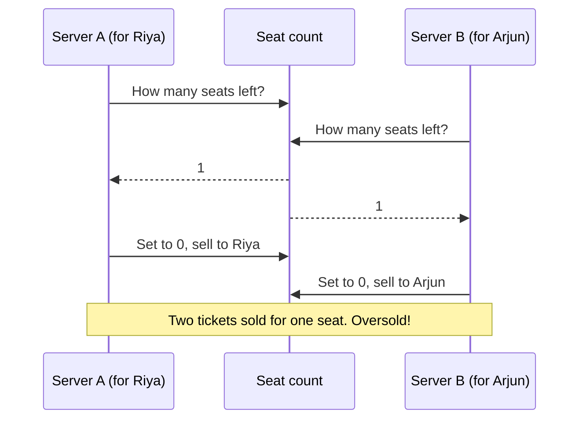
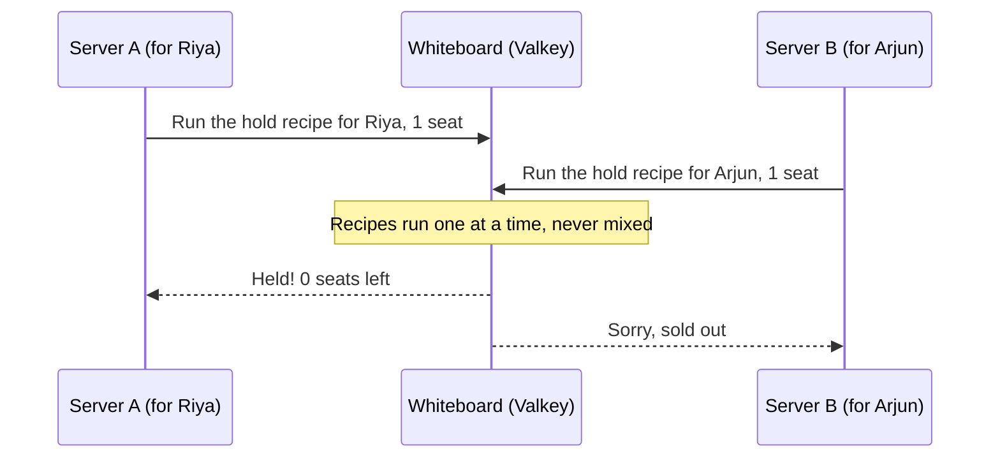
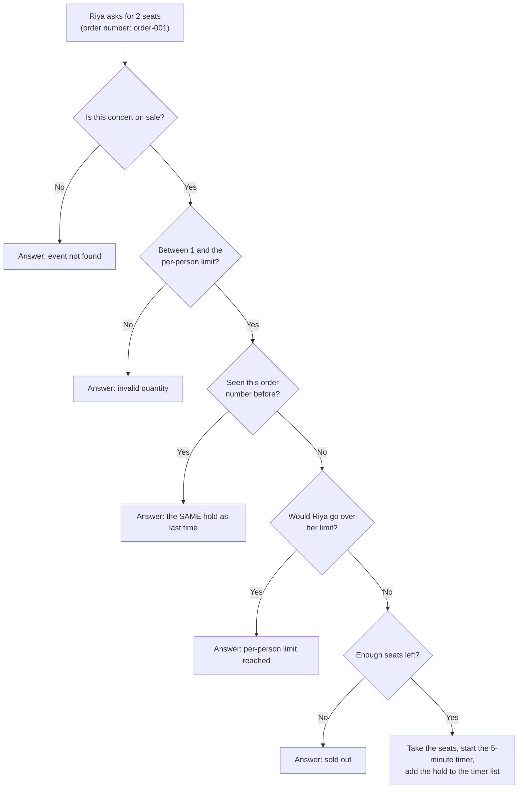
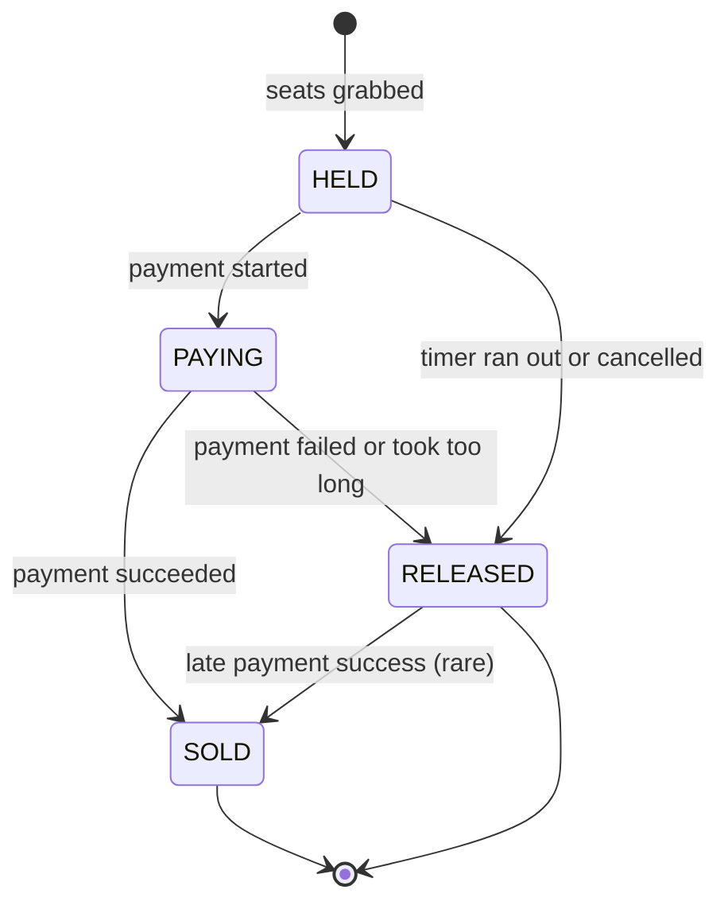
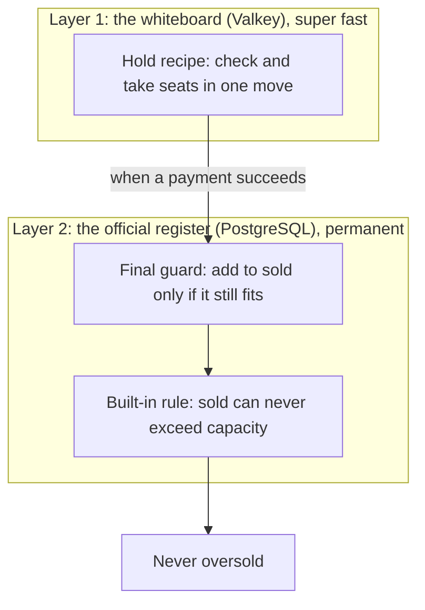
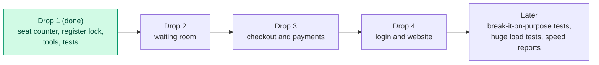

# HoldFast, explained simply

> **The big idea in one sentence:** when lakhs of people rush to buy a few thousand tickets at the same moment, HoldFast makes sure exactly the right number of tickets get sold, fairly, without the website falling over and without anyone losing money.

You don't need to know any coding to read this. If you have ever tried to book a movie ticket, a train ticket or a concert ticket online, you already know half the story.

**What's inside**

1. The problem: the ticket rush
2. Why normal websites break
3. So what is HoldFast?
4. The five promises
5. The journey of one buyer
6. How HoldFast keeps its promises (the clever parts)
7. How do we know it really works?
8. Keeping the system healthy
9. Which part of the problem is solved today?
10. What comes next
11. Where everything lives in the code
12. Try it yourself (optional)
13. Words to know
14. Check your understanding

---

## 1. The problem: the ticket rush

Imagine your favourite band announces **one concert with exactly 1,000 seats**. Tickets go on sale at **12:00 noon**. At 11:59, **5 lakh people** (500,000) are sitting with a thumb over the **Buy** button. At 12:00:00, they all press it in the same second.

That's **500 people for every seat**. Most of them will go home without a ticket, and that part is fine: it's just maths. The hard part is everything else:

- the website must **not crash** under all those clicks;
- **exactly 1,000** tickets must be sold: not 999, and never 1,001;
- nobody should **cheat** their way to the front;
- nobody should **pay without getting a ticket**.

> **This really happens.** On 22 September 2024, about **1.3 crore people (13 million)** logged in to BookMyShow for roughly **1.8 lakh Coldplay tickets**. That's about 72 people for every ticket. The tickets were gone in about 30 minutes, and many soon appeared on resale sites at crazy prices. Fans complained about the site crashing and about being logged out just as the sale opened. [1] [2]
>
> Indian Railways fights the same battle with **Tatkal** tickets. From 1 July 2025, only Aadhaar-verified users can book Tatkal tickets online; an OTP check was added from 15 July 2025, and agents are blocked for the first 30 minutes. All of this is meant to stop bots and bulk booking. [3] [4]

A quick number guide: **1 lakh = 100,000** and **1 crore = 100 lakh = 10,000,000**.

---

## 2. Why normal websites break

A normal website is like a **small shop with one door and one shopkeeper**. It works perfectly when 20 customers come in a day. Now imagine 5 lakh customers arriving in the same second. Six things go wrong.

### Problem 1: The crash

Every tap on "Buy" sends a message called a **request** to a computer called a **server**: a computer somewhere that answers requests, day and night. Each server can only answer so many requests per second. When far more arrive than it can handle, it slows down, and then it stops answering completely. That's the "site is down" moment.

### Problem 2: Overselling (the last-samosa problem)

Picture the school canteen with **one samosa left** and **two counters**.

- At counter A, Riya asks, "Is there a samosa?" The helper checks the board: "Yes, 1 left!" and takes her money.
- At the exact same moment, at counter B, Arjun asks the same thing. His helper checks the same board: "Yes, 1 left!" and takes his money too.
- Both helpers then change the board to "0 left". But two students have paid for **one** samosa.

Websites have exactly this problem, just a million times faster. Two servers read "1 seat left" in the same millisecond, and both sell it. Engineers call this a **race condition**: the result depends on who wins a race that lasts a thousandth of a second.



> **Why not just buy a bigger computer?** A bigger computer answers faster, but the race is still there: two helpers can still read the same board at the same moment. Speed isn't the problem. The problem is that *checking* and *taking* are two separate steps. Section 6 shows how HoldFast fixes this.

### Problem 3: Lost seats

People put seats in their cart and then close the app. If nobody puts those seats back, the site says "sold out" while seats are actually sitting unused.

### Problem 4: Double orders

Your internet stutters, you don't see a reply, and your phone (or you!) presses Buy again. Without protection, you get two orders, or you get charged twice.

### Problem 5: Hoarding and cheating

**Bots** are programs pretending to be people, and they click thousands of times faster than any human. **Scalpers** use many accounts to grab hundreds of tickets and then resell them at ten times the price.

### Problem 6: Money mix-ups

The worst case of all: you **paid but got no ticket**, or someone **got a ticket without paying**.

| Problem | What it feels like to a fan |
|---|---|
| Crash | "The page just keeps loading." |
| Overselling | "I paid, and then they said my seat was given to someone else." |
| Lost seats | "It said sold out... then 10 minutes later, tickets appeared again?" |
| Double orders | "I got charged twice!" |
| Hoarding and cheating | "Sold out in 30 seconds, and now they're on resale for 10 times the price." |
| Money mix-ups | "My money is gone and I have no ticket." |

---

## 3. So what is HoldFast?

**HoldFast is the machine behind the Buy button.** In tech words, it's a **backend**: the part of an app you never see.

Think of a restaurant. The website or app is the **dining area**, where you sit and order. The backend is the **kitchen**: it takes your order, checks what's available, prepares it, and keeps the accounts.

The name says what it does: it **holds** your seats safely while you pay, and it **holds fast** (stays steady) when the crowd rushes in.

HoldFast is built as a **team of small programs**, each with one job, just like a restaurant has a host at the door, a counter, a cashier and an accountant. Each of these small programs is called a **service**.

A few more facts:

- It's written in **Go**, a programming language created at Google that is very good at doing thousands of things at the same time.
- It uses two storage systems (section 6.1 explains why):
  - **Valkey**, a super-fast "whiteboard" that keeps its data in memory (RAM);
  - **PostgreSQL**, a careful "official register" that keeps its data safely on disk.
- It's built the way big tech companies build real systems: with automatic tests, dashboards, safety checks and step-by-step guides for emergencies.

---

## 4. The five promises

HoldFast makes five promises that must stay true **no matter what**: even when lakhs of people click at once, when the internet is flaky, or when a computer crashes. Engineers call promises like these **invariants**.

| # | The promise | What it means for you |
|---|---|---|
| I1 | **Never sell more seats than exist.** | If there are 1,000 seats, at most 1,000 tickets are ever sold. |
| I2 | **Fair turns.** | Bots, extra tabs or faster internet can't push you back in line. |
| I3 | **No seat gets lost.** | Every seat someone holds is either bought or goes back on sale. |
| I4 | **Fair share.** | Nobody gets more than the per-person limit (for example, 4 tickets). |
| I5 | **Money and tickets always match.** | If you paid, you have a ticket. If you have a ticket, you paid. |

---

## 5. The journey of one buyer

Let's follow **Riya** as she buys 2 tickets. The green boxes are **already built**. The grey dashed boxes are **coming in the next stages**.

```mermaid
flowchart LR
    A["Riya opens the app"] --> B["Waiting room<br/>(queue service)"]
    B -->|"her turn: a digital pass"| C["Seat counter<br/>(inventory service)"]
    C -->|"2 seats held for 5 minutes"| D["Checkout<br/>(booking service)"]
    D --> E["Cashier<br/>(payment service)"]
    E -->|"payment OK"| F["Official register lock<br/>(final guard in PostgreSQL)"]
    F --> G["Riya's tickets"]
    classDef built fill:#d1fae5,stroke:#059669,color:#064e3b
    classDef planned fill:#f3f4f6,stroke:#9ca3af,color:#374151,stroke-dasharray: 5 3
    class C,F built
    class A,B,D,E,G planned
```



1. **The waiting room** *(coming in Drop 2).* Before the sale opens, Riya joins an online queue. Everyone who arrives before 12:00 gets a **random** place, like a lottery, so refreshing like crazy or using a bot doesn't help. After 12:00, it's first come, first served.
2. **The digital pass** *(the checking part is built).* When it's Riya's turn, the waiting room gives her a **digital pass**, called a **token**. It says who she is, which concert it's for, and when it expires. It is sealed with a secret digital stamp, so nobody can fake it.
3. **Holding seats** *(built ✅).* Riya asks for 2 seats. The seat counter checks everything in one single move and puts **2 seats on hold for her for 5 minutes**. Nobody else can take them during that time.
4. **Checkout and payment** *(coming in Drop 3).* Riya starts paying. Her seats get a **"do not disturb" sign** for 10 minutes, so they can't be taken away while her bank is thinking.
5. **Writing it in the register** *(the lock is built ✅; the checkout that uses it comes in Drop 3).* When the payment succeeds, the sale is written into the official register. The register checks the rules **one last time**: it refuses, always, to write sale number 1,001.
6. **Tickets!**

And if Riya just closes the app without paying? Her 5 minutes run out, and her 2 seats **automatically go back on sale** for someone else.

---

## 6. How HoldFast keeps its promises

This is the clever part. Each subsection explains one trick.

### 6.1 Two notebooks: a whiteboard and a register

HoldFast keeps track of seats in two places.

| | **The whiteboard (Valkey)** | **The official register (PostgreSQL)** |
|---|---|---|
| Where the data lives | In memory (RAM) | On disk |
| Speed | Extremely fast: tens of thousands of updates per second | Fast, but slower and more careful |
| If the power goes out | Could lose about the last second of changes (in our setup) | Keeps everything |
| Its job in HoldFast | Holding seats during the rush | The final, permanent record of every sale |

Why keep two? During the rush, **speed** matters most, so seats are held on the whiteboard. But money and tickets must **never be forgotten**, so every sale is written in the register.

The register is the boss. If the whiteboard is ever wiped (say, a machine crashes), HoldFast can **rebuild** the whiteboard from the register with one command.

### 6.2 The "one move" rule: how HoldFast never oversells

Remember the samosa problem? The fix is simple to say:

> **Checking and taking must happen as one single move that nobody can interrupt.**

Imagine the canteen now has **one helper who guards the samosa jar**, and she serves students strictly one at a time. She looks in the jar and hands over the samosa in one motion, and only then turns to the next student. Now two students can never both get the last samosa, however fast they are.

In HoldFast, that careful helper is the whiteboard (Valkey). We give it small **recipes** written in a programming language called **Lua**. When a recipe runs, the whiteboard finishes it completely before it even looks at the next request. Engineers call this **atomic**, from a Greek word meaning "cannot be cut".

Here is the same race as before, done the HoldFast way:



These are the questions the **hold recipe** asks, in this order, every time someone wants seats:



All five questions **and** the "take the seats" step happen inside **one** recipe, as one move. Here are three real lines from HoldFast's hold recipe (`hold.lua`). The check and the take sit inside the same recipe, so nothing can sneak in between them:

```lua
local avail = tonumber(redis.call('GET', KEYS[1]) or '0')  -- how many seats are left?
if avail < qty then return {0, avail, 0} end               -- not enough: answer "sold out"
redis.call('DECRBY', KEYS[1], qty)                          -- take the seats
```

The recipe says `redis.call` because Valkey began as a copy of another database called Redis, and it still understands the same commands.

### 6.3 Seats on a timer (so no seat gets lost)

A hold is like a **restaurant table kept for you for 5 minutes**. If you don't turn up, the table goes to the next person.

Every hold goes on a **timer list**, sorted by when each timer rings. A small helper program called the **sweeper** checks that list **every half second**. Whenever a timer has run out, it puts those seats back on sale.

Two neat details:

- **Everyone uses the same clock.** The time on each timer comes from the whiteboard's own clock, not from each server's clock, so every copy of HoldFast agrees on exactly when a hold expires.
- **Several sweepers can work at once, safely.** If two sweepers try to return the same seats, the "put back" recipe first checks whether they were already returned. Putting seats back is also a single atomic move, so seats can never be returned twice.

Here is the whole life of a hold:



| State | What it means |
|---|---|
| HELD | Seats are kept for you, and the 5-minute timer is running. |
| PAYING | You started paying; "do not disturb" for 10 minutes. |
| SOLD | Paid and final. |
| RELEASED | The seats went back on sale. |

### 6.4 Pressing Buy twice does not buy twice

Every time the app asks for seats, it attaches an **order number**, like the number printed on a receipt. (The tech name is **idempotency key**.) HoldFast works out the hold's ID from **who you are plus your order number**, a bit like a fingerprint. So:

- **Same person, same order number:** HoldFast returns **the same hold** it already made. No extra seats, no second charge.
- **Same order number, but a *different* number of seats:** HoldFast refuses, because that looks like a mistake or a trick.

So if your internet stutters and your phone sends "hold 2 seats" three times, you still end up with **exactly 2 seats**. Engineers call this **idempotency**: doing something twice has the same effect as doing it once.

### 6.5 Fair share: the per-person limit

Each concert has a **per-person limit**, for example 4 tickets. HoldFast keeps a small counter for every buyer, and the hold recipe checks it **in the same single move** as everything else. The official register checks the limit again when a sale is written.

In one test, a single buyer fired **40 requests at the same instant** for a concert with a limit of 4. Exactly **4** got through, and the other 36 were politely refused.

### 6.6 The digital pass: why it can't be faked

When the waiting room lets you in, it gives you a **digital pass** (a **token**). Think of your **exam hall ticket**: it has your name, the exam, and the principal's signature and stamp, so the invigilator knows it's real.

The pass contains:

- **who you are** (your user ID),
- **which concert** it's for,
- **when it expires** (a few minutes later),
- a unique pass number.

The waiting room seals the pass with a **digital signature**, made with a **secret key** that only the waiting room has. The seat counter checks the seal using a matching **public key**. The public key can *check* seals but can never *make* them, just as everyone can recognise the principal's signature but only the principal can sign. Change even one letter on the pass, and the seal no longer matches, so the pass is rejected.

HoldFast also refuses a pass that:

- has expired;
- was made for a **different concert** (a pass for concert A can't buy seats for concert B);
- uses a trick such as "no signature at all" or the wrong kind of signature.

For the curious: the signature method is called **Ed25519**, and the pass format is called a **JWT** (JSON Web Token).

### 6.7 The last line of defence: the register's lock

What if the whiteboard ever had a bug? HoldFast doesn't blindly trust it. When a sale is written into the official register, the register checks the rules **again**, in its own single move:

> "Add 1 to *sold*, **but only if** *sold* plus 1 is still no more than the *capacity*."

If there's no room, the register simply refuses. On top of that, the register's table has a **built-in rule** that sold can never be bigger than capacity. Even a buggy program can't break it, just like a register that physically has only 1,000 lines. The per-person limit is checked here again too.

If one of these checks fails halfway through, the register **undoes the half-finished change**. It's like writing in pencil first and rubbing it out if something is wrong, before anything gets written in ink. Engineers call this a **savepoint**.



To oversell, **both** layers would have to fail at the same moment. Using more than one lock for the same danger is called **defence in depth**.

### 6.8 While you pay: the "do not disturb" sign

When you start paying, your hold changes from HELD to PAYING, and its timer is extended to **10 minutes**. The sweeper leaves it alone during that time.

You also can't cancel a hold while it's PAYING. Your money might already be on its way, and HoldFast won't give your seats away in the middle of a payment.

### 6.9 The rare late payment

Sometimes a bank takes too long, or reports "failed" when the money actually went through. If a payment turns out to be real after the seats were already released, HoldFast **doesn't pretend it didn't happen**. It gives the buyer their seats (taking them back from the pool) and counts it as a "late" sale on the dashboard, so staff can see it.

The official register still has the final say, so the total number of tickets sold can never go over the number of seats. Being honest about money beats keeping the numbers looking pretty.

### 6.10 Staff-only doors and other safety locks

- **A separate staff door.** Buyers use the front door (the public port). Settings, health checks and staff tools live behind a separate back door (the admin port) that is never opened to the internet. Staff actions also need a secret staff password.
- **No weird characters sneak in.** Every ID is checked and converted into one standard format before it's used, so nobody can trick the system with strange symbols.
- **Secrets are read once and thrown away.** The program reads its passwords when it starts, then removes them from its surroundings so no other program can peek.
- **Locked-down packaging.** The program ships in a tiny, bare container with no extra tools inside, and it runs without administrator ("boss") powers.

### 6.11 Everything in one table

| In HoldFast | In real life |
|---|---|
| Waiting room (queue service) | The queue outside a stadium, with token numbers |
| Digital pass (token) | An exam hall ticket with the principal's stamp |
| Seat counter (inventory service) | A canteen counter with one very careful helper |
| Whiteboard (Valkey) | The counter's whiteboard: fast, but it can be wiped |
| Official register (PostgreSQL) | The office register, written in ink |
| Hold timer | A restaurant table kept for you for 5 minutes |
| Sweeper | The helper who puts abandoned items back on the shelf |
| Order number (idempotency key) | The number on your receipt |
| Register's lock (final guard) | A register that physically has only 1,000 lines |
| Staff door (admin port) | The staff-only back entrance |

---

## 7. How do we know it really works?

Saying "it never oversells" is easy. **Proving** it is the real work. HoldFast is tested in four ways.

### 7.1 The stress test: 50,000 buyers, 1,000 seats

We built a program (called **Experiment E1**) that creates **50,000 pretend buyers** and makes them all grab for **1,000 seats**, with 1,000 requests flying at the same time. Then it checks the promises. These are the real results:

| Test | Result | Promise checked |
|---|---|---|
| 50,000 buyers race for 1,000 seats on the whiteboard | **Exactly 1,000** got seats; 49,000 were told "sold out"; **0 errors** | Never oversell |
| Seats left afterwards | **Exactly 0** (1,000 minus 1,000) | No seat lost |
| Every winner's hold checked afterwards | **1,000 of 1,000** stored correctly | No seat lost |
| 10,000 payments race for 1,000 seats in the register | **Exactly 1,000** sold, and the sales records add up to 1,000 | Never oversell (second lock) |
| One buyer fires 40 requests at once, with a limit of 4 | **Exactly 4** got through | Fair share |

Even on a small test machine with just one processor core, the whiteboard handled roughly **34,000 to 37,000 attempts per second**. Proper speed tests on bigger machines come later, so read that number as "fast enough", not as a record.

### 7.2 The robot referee

We also wrote the rules down as a tiny, simple program: the **referee**. Then a robot plays **1,500 random moves** (grab seats, cancel, start paying, pay, payment fails, late payment...) on the real system **and** in the referee's notebook at the same time.

After **every single move**, the two must agree exactly. If they ever disagree, the test fails and prints a "seed" number that replays the exact same game, so the bug can be found. It has passed on 7 different random games.

### 7.3 Ordinary tests

There are **58 tests** (117 if you count the smaller checks inside them), and all of them pass. They run with a **race detector** switched on: a tool that watches for two parts of the program stepping on each other's toes. They test against the real whiteboard and the real register, not fake stand-ins.

### 7.4 The robot examiner

HoldFast is set up so that every time the code changes, **GitHub Actions** (a robot service on GitHub) automatically:

- checks the code style,
- runs all the tests,
- runs the **50,000-buyer stress test**,
- scans for security problems,
- builds the program.

If anything fails, the change is blocked. The "never oversell" promise gets re-proven on **every single change**. This kind of robot examiner is called **CI** (continuous integration).

---

## 8. Keeping the system healthy

- **Dashboards (like a car's dashboard).** A car shows speed, fuel and engine temperature. HoldFast's dashboard (built with tools called **Prometheus** and **Grafana**) shows how many people are trying to hold seats each second, how many were told "sold out", how many seats are left, how long each step takes, and how many holds were returned by timers.
- **A diary with tracking numbers.** Every request gets a **request ID**, like a courier tracking number. The program writes notes into its **log** (a diary), each tagged with that ID, so we can follow one request's whole journey if something goes wrong.
- **Two health questions.** The computers that manage HoldFast can ask it two questions at any time: "Are you alive?" and "Are you ready for customers?" *Alive* means the program is running. *Ready* also means it can reach its whiteboard. A copy that isn't ready simply stops receiving buyers until it is.
- **Closing the shop politely.** When HoldFast needs to restart, for example for an update, it behaves like a shop at closing time. First it stops accepting new customers, then it lets the people already inside finish, and only then does it lock the door. Nobody gets cut off in the middle of a purchase.
- **Failing safely.** If the whiteboard can't be reached, HoldFast doesn't guess. It politely says "please try again in 1 second" instead of giving a wrong answer.
- **Emergency cards.** For each kind of problem there's a written step-by-step guide, called a **runbook**, like the fire-drill instructions on a classroom wall. One of them explains how to rebuild the whiteboard from the register.

---

## 9. Which part of the problem is solved today?

HoldFast is being built in stages called **drops**. **Drop 1 is finished.** It's the heart of the system: the seat counter and the register's lock, plus all the tools and tests around them.

Why build the seat counter first? Because it's the part that must **never** be wrong. If it oversells, nothing else matters. Every other part (the waiting room, checkout, payments) plugs into it.

| Problem (from section 2) | HoldFast's answer | Status |
|---|---|---|
| Overselling | One-move recipes on the whiteboard, plus the register's lock | ✅ Solved and tested |
| Lost seats | Timers plus the sweeper | ✅ Solved and tested |
| Double orders | Order numbers (idempotency) | ✅ Solved and tested |
| Hoarding by one person | A per-person limit, checked in both notebooks | ✅ Solved and tested |
| Fake or borrowed passes | Signed passes, each valid for one concert only | ✅ Checking is built; handing out passes comes with the waiting room |
| Crashing under the rush | A fast whiteboard, polite restarts, and a waiting room that controls the crowd | 🟡 Partly: the seat counter is built for rushes; the waiting room arrives in Drop 2 |
| Bots and unfair order | A waiting room with a lottery before opening | ⏳ Drop 2 |
| Money mix-ups | Checkout, a cashier, and messages that can never get lost | ⏳ Drop 3 |

In numbers, Drop 1 is **80 files** and about **6,000 lines of Go code**, and about a third of that code is tests.

---

## 10. What comes next



- **Drop 2: the waiting room (queue service).** Everyone who arrives before the sale opens gets a random place in line (a lottery), so refreshing and bots stop helping. After opening, it's first come, first served. The waiting room hands out the digital passes, replacing the practice passes we use for testing today.
- **Drop 3: checkout and payments.** This adds the booking service and the payment service, plus a pretend bank that can be told to be slow or to fail, so we can test the scary cases. Messages between services are written into the register first and sent afterwards, so they can never get lost (engineers call this the **outbox** pattern). We also add **tracing**: a GPS trail that follows one purchase across all the services.
- **Drop 4: login and the website.** Accounts, and the actual website buyers will use.
- **Later: proving it under fire.** "Chaos" tests, where we deliberately crash parts of the system to prove it survives; giant load tests with many more buyers; and a written report with real speed numbers.

---

## 11. Where everything lives in the code

| Folder | What's inside | Think of it as |
|---|---|---|
| `cmd/inventory` | The seat counter service | The canteen counter |
| `cmd/holdfastctl` | A staff tool: set up the register, create concerts, make practice passes | The staff toolbox |
| `cmd/contention` | The 50,000-buyer stress test | The fire drill |
| `internal/inventory` | The hold logic, the five Lua recipes, the sweeper | The counter's rulebook |
| `internal/booking/guard` | The register's lock | The lock on the register |
| `internal/booking/catalog` | The list of concerts | The events notice board |
| `internal/platform` | Shared parts every service uses: settings, logs, health checks, passes, dashboards | The building's wiring and plumbing |
| `db/migrations` | Plans for the register's tables | The architect's blueprints |
| `deploy` | Dashboard settings | The dashboard's wiring |
| `docs` | Manuals, emergency cards, design decisions | The instruction booklets |
| `.github/workflows` | The robot examiner's instructions | The exam timetable |

The five Lua recipes are **provision** (set up a concert's seats), **hold** (grab seats), **mark_paying** (put up the "do not disturb" sign), **release** (return seats) and **confirm** (mark seats as sold).

---

## 12. Try it yourself (optional)

If you have **Go**, **Docker** and **make** installed, you can run all of HoldFast on your own computer:

```bash
go mod tidy                                   # download the building blocks HoldFast uses
make up                                       # start everything: both notebooks, the seat counter, dashboards
make event NAME="School Fest" CAPACITY=100    # create a concert with 100 seats (prints its ID)
export EVENT=<the ID it printed>
export TOKEN=$(make -s token EVENT=$EVENT)    # make a practice digital pass

# ask how many seats are left
curl -s localhost:8081/v1/events/$EVENT/availability

# hold 2 seats (the Idempotency-Key is your order number)
curl -s -X POST localhost:8081/v1/events/$EVENT/holds \
  -H "Authorization: Bearer $TOKEN" \
  -H "Idempotency-Key: order-001" \
  -H 'Content-Type: application/json' -d '{"quantity":2}'

make e1                                       # run the 50,000-buyer stress test
```

Then open **http://localhost:3000** to see the live dashboard.

Try running the "hold 2 seats" command twice with the same order number. You'll get the **same** hold back, not 4 seats. That's idempotency in action.

---

## 13. Words to know

| Word | Simple meaning |
|---|---|
| Server | A computer somewhere that answers requests, day and night |
| Request | A message your app sends, like "hold 2 seats for me" |
| Backend | The hidden "kitchen" part of an app |
| Service | A small program with one job; HoldFast is a team of them |
| API | The menu of requests a service understands |
| Database | An organised place to store information |
| Valkey | HoldFast's fast "whiteboard": data kept in memory |
| PostgreSQL | HoldFast's "official register": data kept safely on disk |
| Race condition | A bug where the result depends on who wins a split-second race |
| Atomic | Done as one move that can't be interrupted or split |
| Lua recipe (script) | A short list of steps the whiteboard runs as one atomic move |
| Hold | Seats kept for you for a short time while you pay |
| Sweeper | The helper program that returns seats whose timer ran out |
| Idempotency key | Your order number; repeating a request with it doesn't repeat the purchase |
| Token (digital pass) | Proof that the waiting room let you in, sealed with a digital signature |
| Digital signature | A seal made with a secret key and checked with a public key; it can't be faked |
| Invariant | A promise that must always stay true |
| Defence in depth | Using more than one lock for the same danger |
| Metrics | The numbers on the dashboard, like "sold-out answers per second" |
| Log | The program's diary |
| Graceful shutdown | Closing politely: stop new customers, finish current ones, then stop |
| Container (Docker) | A lunchbox that packs a program with everything it needs, so it runs the same anywhere |
| CI | The robot examiner that tests every code change automatically |
| Migration | A step-by-step plan that creates or changes the register's tables |

---

## 14. Check your understanding

<details>
<summary>1. Why doesn't a bigger, faster computer fix overselling?</summary>

Because the problem isn't speed; it's the race. As long as "check how many seats are left" and "take a seat" are two separate steps, two requests can check at the same moment and both see "1 left". HoldFast fixes this by doing both steps as one atomic move.

</details>

<details>
<summary>2. You hold 2 seats and then close the app. What happens to the seats?</summary>

The 5-minute timer runs out, and the sweeper (which checks every half second) puts both seats back on sale for someone else.

</details>

<details>
<summary>3. Your internet glitches, and your phone sends "hold 2 seats" three times with the same order number. How many seats do you end up with?</summary>

Exactly 2. HoldFast works out the hold's ID from you plus the order number, so the repeats just get the same hold back. That's idempotency.

</details>

<details>
<summary>4. Why does HoldFast keep two notebooks instead of one?</summary>

The whiteboard (Valkey) is fast enough for the rush, and the register (PostgreSQL) is permanent and has the final say. If the whiteboard is wiped, it can be rebuilt from the register. And to oversell, both would have to fail at the same time.

</details>

<details>
<summary>5. Someone copies a friend's digital pass and changes the concert name on it. What happens?</summary>

The digital seal no longer matches, so the pass is rejected. And even an untouched pass works only for the one concert it was made for.

</details>

<details>
<summary>6. In the stress test, 50,000 pretend buyers raced for 1,000 seats. How many got a hold?</summary>

Exactly 1,000. The other 49,000 were told "sold out", and there were zero errors.

</details>

---

## Want the technical version?

This page is the friendly overview. The engineer's versions live in the HoldFast repository:

- `docs/design/holdfast-design-and-build-plan.mdx`: the full design and build plan
- `docs/architecture.md`: the system map
- `docs/services/inventory.md`: every endpoint, error code and setting of the seat counter

## Sources

1. Malay Mail: Coldplay's India concerts sell out in about 30 minutes; 13 million users for roughly 1.8 lakh tickets. [malaymail.com](https://www.malaymail.com/news/showbiz/2024/09/29/coldplays-three-concerts-in-india-sells-out-in-30-minutes-tickets-resold-for-as-high-as-rm49261/151988)
2. Pollstar: the Coldplay on-sale exposes issues with India's ticketing systems. [news.pollstar.com](https://news.pollstar.com/2024/10/15/its-become-a-joke-coldplay-onsale-exposes-issues-with-indias-ticketing-systems/)
3. All India Radio News: Aadhaar authentication mandatory for online Tatkal booking. [newsonair.gov.in](https://www.newsonair.gov.in/aadhaar-authentication-made-mandatory-for-online-tatkal-ticket-booking-from-july-15)
4. Deccan Herald: only Aadhaar-authenticated users can book Tatkal tickets from 1 July; agent restrictions. [deccanherald.com](https://www.deccanherald.com/amp/story/india%2Fonly-aadhaar-authenticated-users-can-book-tatkal-tickets-from-july-1-railway-ministry-3580809)
